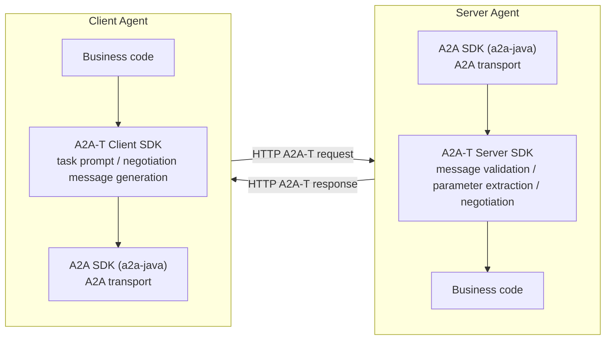

<!--
Copyright (c) 2026 Huawei Technologies Co., Ltd.
All Rights Reserved.

SPDX-License-Identifier: Apache-2.0

   Licensed under the Apache License, Version 2.0 (the "License"); you may
   not use this file except in compliance with the License. You may obtain
   a copy of the License at

        http://www.apache.org/licenses/LICENSE-2.0

   Unless required by applicable law or agreed to in writing, software
   distributed under the License is distributed on an "AS IS" BASIS, WITHOUT
   WARRANTIES OR CONDITIONS OF ANY KIND, either express or implied. See the
   License for the specific language governing permissions and limitations
   under the License.
-->

# a2a-t-sdk-java

<p align="center">
  <a href="https://dev.java/"></a>
  <a href="LICENSE"></a>
</p>
<p align="center">
  <strong>Java SDK used to generate task prompts and handle task negotiation flows based on the A2A-T protocol.</strong>
</p>
<p align="center">
  <a href="./README_zh.md">中文</a>
</p>

---

## Project Overview

A2A-T (Agent-to-Agent Telecom) is a telecom-domain multi-agent interconnection protocol extended from the A2A protocol. It enhances capabilities such as information models, task negotiation, and collaboration security for telecom business scenarios, enabling deterministic, highly reliable, efficient, and secure collaboration among telecom agents.

`a2a-t-sdk-java` is the Java SDK of the A2A-T protocol. Its core responsibility is to **generate, validate, and negotiate task prompts** (structured protocol messages) in A2A-T interactions. The SDK mainly serves two types of users:

- **Client agent**: converts natural-language or structured input into task prompts that conform to the A2A-T format, and initiates, receives, and advances negotiation flows.
- **Server agent**: validates whether the A2A-T messages sent by the client satisfy the scenario, template, and slot constraints, extracts parameters, and advances negotiation flows.

The A2A-T SDK is independent of the A2A SDK; using the two together builds agents with full A2A-T protocol support (in the Java ecosystem, the matching A2A SDK is a2a-java, coordinates `org.a2aproject.sdk`):



## Core Capabilities

| Capability | Description |
| --- | --- |
| Task prompt generation (client) | Covers input normalization, scenario recognition, slot extraction, and template rendering; supports both natural-language and structured-data input |
| Message validation and parameter extraction (server) | Performs metadata parsing, slot extraction, and semantic validation on task prompts that conform to the SDK format, extracts parameters per a schema, and returns details of missing/invalid slots |
| Multi-round negotiation & negotiation state management | Supports the three negotiation types `information` / `feasibility` / `target` with template-driven negotiation message generation; covers negotiation types, the runtime state machine, and state storage (currently an in-memory implementation) |
| Resource organization | Built-in prompt resources (`prompts` / `scenarios` / `slots` / `templates`) live in `a2a-t-resources` and support both classpath and local-file loading |
| LLM adaptation | Provides OpenAIClient by default, supports LLMs compatible with the OpenAI specification, and allows custom LLM integration |
| Built-in samples | Ships runnable sample scenarios such as `subscribe_incident` (incident subscription), which run end to end with zero external dependencies |

## Project Structure

The repository is organized as Maven multi-modules, with core code under each module's `src/main/java`:

| Module | Description |
| --- | --- |
| `a2a-t-bom` | Bill of materials (BOM) that aligns library module versions |
| `a2a-t-core` | Shared `.env` configuration loading, value types, JSON parsing abstractions, and exception handling |
| `a2a-t-resources` | Packaging and classpath loading of built-in prompt resources |
| `a2a-t-llm` | LLM adapter layer; supports custom LLM integration and provides OpenAIClient by default |
| `a2a-t-prompt` | Prompt resource model and loading, scenario recognition, slot extraction, and template rendering |
| `a2a-t-negotiation` | Negotiation types, runtime state machine, and state storage |
| `a2a-t-client` | Client facade providing task prompt generation and negotiation entry points (`A2ATClient`) |
| `a2a-t-server` | Server facade providing A2A-T protocol message validation and negotiation entry points (`A2ATServer`) |
| `a2a-t-corpus` | Accuracy verification corpus (pure test module): data-driven workflow cases executed against a real LLM; excluded from packaging and CI |
| `a2a-t-sample` | Runnable client/server samples |

Each module's `src/test/java` mirrors the main package structure, covering the negotiation state machine, negotiation handlers, resource loaders, prompt rendering, and client/server orchestration.

## Quick Start

### Environment Requirements

| Item | Requirement |
| --- | --- |
| JDK | `>=17` |
| Build tool | Maven (no wrapper is bundled; install it locally) |
| LLM | Optional. Without an API key, samples automatically fall back to the built-in mock LLM and run with zero external dependencies |

### Run the First Demo in Three Steps

Taking the `subscribe_incident` (incident subscription) scenario as an example: the client generates a Notification-T task prompt based on natural-language input and sends it to the server over a real HTTP A2A link; the server validates the message, establishes the event subscription, and pushes notifications. Run all commands from the **repository root**:

```bash
# 1. Build (generates a2a-t-sample/target/sample.args)
mvn -pl a2a-t-sample -am -DskipTests package

# 2. Terminal 1: start the server (listens on 127.0.0.1:26335 by default)
java @a2a-t-sample/target/sample.args net.openan.a2at.sample.subscribe_incident.server.ServerSampleMain

# 3. Terminal 2: start the client
java @a2a-t-sample/target/sample.args net.openan.a2at.sample.subscribe_incident.client.ClientSampleMain
```

After startup, full-pipeline logs are visible: client-side scenario recognition and slot extraction, the generated task prompt, the A2A request message, and the server-side validation result and subscription notification push.

> If Chinese characters look garbled in a Windows console, run `chcp 65001` first.

### Connect a Real LLM (Optional)

Edit `client/client.env` and `server/server.env` under `a2a-t-sample/src/main/resources/sample/subscribe-incident/` and fill in any OpenAI-compatible endpoint:

```properties
# LLM protocol type
A2AT_LLM_PROVIDER=openai
# Model name
A2AT_LLM_MODEL=<model name>
# Model endpoint
A2AT_LLM_BASE_URL=<OpenAI-compatible endpoint>
# LLM API key
A2AT_LLM_API_KEY=<your API key>
```

You can also copy the env file and specify it via a startup argument: `java @a2a-t-sample/target/sample.args <MainClass> /path/to/.env`. For a description of all configuration items, see `env.example` at the repository root.

### Development and Testing

```bash
# Run all tests
mvn test
```

For more runnable samples (end-to-end negotiation, service recovery, authorization policy, private-line complaint, etc.), see [a2a-t-sample/README.zh-CN.md](a2a-t-sample/README.zh-CN.md).

## More Documents

| Document | Location | Content |
| --- | --- | --- |
| Developer Guide | [docs/en/developer_guide.md](docs/en/developer_guide.md) | Feature introduction, installation and integration, parameter configuration, and minimal practices |
| API Reference | [docs/en/API_Reference.md](docs/en/API_Reference.md) | Full API definitions and usage instructions for `A2ATClient` / `A2ATServer` |

## Current Scope of Support

Before use, it is recommended to confirm the following limitations:

- The built-in LLM invocation chain is unified externally as an OpenAI adaptation layer.
- LLM prompt resources are built in and do not support customization or extension.
- Negotiation state storage currently only provides an in-memory implementation and does not guarantee persistence.
- The bundled resources and language coverage are limited, and do not include remote resource loading capabilities such as `registry-center`.
- This document primarily introduces the SDK itself, and does not cover the CLI, hosted services, deployment processes, or ready-to-use application solutions.

## License

This project is licensed under the [Apache-2.0](LICENSE) license.
