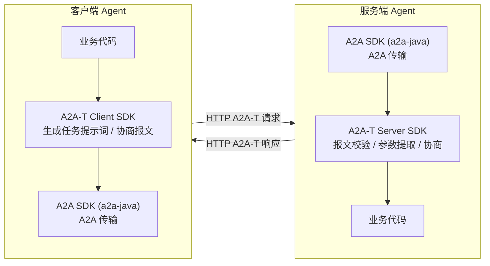

<!--
Copyright (c) 2026 Huawei Technologies Co., Ltd.
All Rights Reserved.

SPDX-License-Identifier: Apache-2.0

   Licensed under the Apache License, Version 2.0 (the "License"); you may
   not use this file except in compliance with the License. You may obtain
   a copy of the License at

        http://www.apache.org/licenses/LICENSE-2.0

   Unless required by applicable law or agreed to in writing, software
   distributed under the License is distributed on an "AS IS" BASIS, WITHOUT
   WARRANTIES OR CONDITIONS OF ANY KIND, either express or implied. See the
   License for the specific language governing permissions and limitations
   under the License.
-->

# a2a-t-sdk-java

<p align="center">
  <a href="https://dev.java/"></a>
  <a href="LICENSE"></a>
</p>
<p align="center">
  <strong>基于A2A-T协议用于生成任务提示词并处理任务协商流程的Java SDK。</strong>
</p>
<p align="center">
  <a href="./README.md">English</a>
</p>

---

## 项目简介

A2A-T（Agent-to-Agent Telecom）是基于 A2A 协议扩展的电信领域多智能体互联协议，针对电信业务场景的信息模型、任务协商、协作安全等能力进行增强，支撑电信领域多智能体之间确定性、高可靠、高效且安全的协同。

`a2a-t-sdk-java` 是 A2A-T 协议的 Java SDK，核心职责是在 A2A-T 交互中**生成、校验与协商任务提示词**（结构化协议报文）。SDK 主要面向两类使用方：

- **客户端 Agent**：将自然语言或结构化输入转化为符合 A2A-T 格式的任务提示词，并发起、接收和推进协商流程。
- **服务端 Agent**：校验客户端下发的 A2A-T 报文是否满足场景、模板与槽位约束，提取参数并推进协商流程。

A2A-T SDK 独立于 A2A SDK，两者配合使用即可构建完整支持 A2A-T 协议的智能体（Java 生态中可搭配的 A2A SDK 为 a2a-java，坐标 `org.a2aproject.sdk`）：



## 核心能力

| 能力 | 说明 |
| --- | --- |
| 任务提示词生成（客户端） | 覆盖输入归一化、场景识别、槽位提取与模板渲染，支持自然语言与结构化数据两种输入 |
| 报文校验与提参（服务端） | 对符合 SDK 格式的任务提示词执行元数据解析、槽位提取与语义校验，按 Schema 提取参数并返回缺失/非法槽位明细 |
| 多轮协商&协商状态管理 | 支持 `information` / `feasibility` / `target` 三类协商，提供模板驱动的协商报文生成；协商类型、运行时状态机与状态存储（当前提供内存实现） |
| 资源组织 | 内置提示词资源（`prompts` / `scenarios` / `slots` / `templates`）位于 `a2a-t-resources`，支持 `classpath` 与本地文件两种加载方式 |
| LLM 适配 | 默认提供 OpenAIClient，支持接入兼容 OpenAI 规范的 LLM，并支持自定义 LLM 接入 |
| 内置示例 | 随包提供 `subscribe_incident`（事件订阅）等可运行示例场景，无需外部依赖即可端到端跑通 |

## 项目结构

仓库采用 Maven 多模块组织，核心代码位于各模块的 `src/main/java`：

| 模块 | 说明 |
| --- | --- |
| `a2a-t-bom` | 物料清单（BOM），统一管理各库模块版本 |
| `a2a-t-core` | 共享的 `.env` 配置加载、值类型、JSON 解析抽象与异常处理 |
| `a2a-t-resources` | 内置提示词资源的打包与 classpath 加载 |
| `a2a-t-llm` | LLM 适配层，支持自定义 LLM 接入，默认提供 OpenAIClient |
| `a2a-t-prompt` | 提示词资源模型与加载、场景识别、槽位提取与模板渲染 |
| `a2a-t-negotiation` | 协商类型、运行时状态机与状态存储 |
| `a2a-t-client` | 客户端封装，提供任务提示词生成与协商入口（`A2ATClient`） |
| `a2a-t-server` | 服务端封装，提供 A2A-T 协议报文的校验与协商入口（`A2ATServer`） |
| `a2a-t-corpus` | 准确性验证语料（纯测试模块）：数据驱动工作流用例，需配置真实 LLM 执行；不参与打包与 CI |
| `a2a-t-sample` | 可运行的客户端/服务端示例 |

各模块的 `src/test/java` 与 main 包结构对应，覆盖协商状态机、协商处理器、资源加载器、提示词渲染以及客户端/服务端编排等测试用例。

## 快速开始

### 环境要求

| 项 | 要求 |
| --- | --- |
| JDK | `>=17` |
| 构建工具 | Maven（仓库未内置 wrapper，需本地安装） |
| LLM | 可选。未配置 API Key 时示例自动降级为内置 Mock LLM，零外部依赖即可跑通 |

### 三步跑通首个 Demo

以 `subscribe_incident`（事件订阅）场景为例：客户端基于自然语言输入生成 Notification-T 任务提示词，经真实 HTTP A2A 链路发送给服务端；服务端校验报文、建立事件订阅并推送通知。以下命令均在**仓库根目录**执行：

```bash
# 1. 构建（生成 a2a-t-sample/target/sample.args）
mvn -pl a2a-t-sample -am -DskipTests package

# 2. 终端一：启动服务端（默认监听 127.0.0.1:26335）
java @a2a-t-sample/target/sample.args net.openan.a2at.sample.subscribe_incident.server.ServerSampleMain

# 3. 终端二：启动客户端
java @a2a-t-sample/target/sample.args net.openan.a2at.sample.subscribe_incident.client.ClientSampleMain
```

启动后可观察到完整链路日志：客户端场景识别与槽位提取、生成的任务提示词、A2A 请求报文，以及服务端校验结果和订阅通知推送。

> Windows 控制台如遇中文乱码，先执行 `chcp 65001`。

### 接入真实 LLM（可选）

编辑 `a2a-t-sample/src/main/resources/sample/subscribe-incident/` 下的 `client/client.env` 与 `server/server.env`，填入任一 OpenAI 兼容端点：

```properties
# LLM协议类型
A2AT_LLM_PROVIDER=openai
# 模型名称
A2AT_LLM_MODEL=<模型名>
# 模型地址
A2AT_LLM_BASE_URL=<OpenAI 兼容地址>
# LLM API KEY
A2AT_LLM_API_KEY=<你的 API Key>
```

也可复制 env 文件后通过启动参数指定：`java @a2a-t-sample/target/sample.args <MainClass> /path/to/.env`。全部配置项说明见根目录 `env.example`。

### 开发与测试

```bash
# 运行全部测试
mvn test
```

更多可运行示例（协商端到端、业务抢通、授权策略、专线投诉等）见 [a2a-t-sample/README.zh-CN.md](a2a-t-sample/README.zh-CN.md)。

## 更多文档

| 文档 | 位置 | 内容 |
| --- | --- | --- |
| 开发指南 | [docs/zh/开发指南.md](docs/zh/开发指南.md) | 特性介绍、安装接入、参数配置与最小实践 |
| API 参考 | [docs/zh/API参考.md](docs/zh/API参考.md) | `A2ATClient` / `A2ATServer` 全量 API 定义与使用说明 |

## 当前支持范围

使用前建议先确认以下限制：

- 内置 LLM 调用链对外统一为 OpenAI 适配层。
- 大模型提示词资源已内置，不支持自定义扩展。
- 协商状态存储目前仅提供内存实现，不保证持久化。
- 随包资源与语言覆盖有限，不包含 `registry-center`（注册中心）等远程资源加载能力。
- 本文档主要介绍 SDK 本身，不涉及 CLI、托管服务、部署流程或可直接使用的应用方案。

## 许可证

本项目采用 [Apache-2.0](LICENSE) 许可证。
