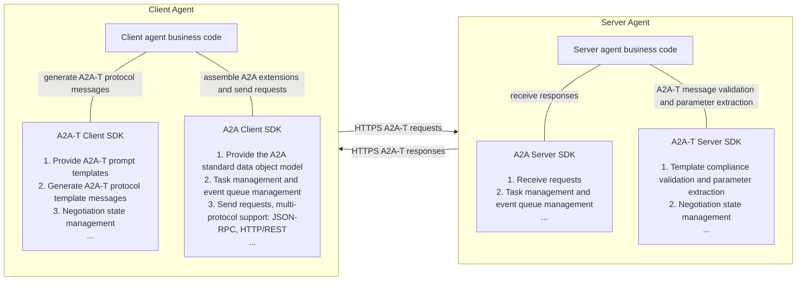
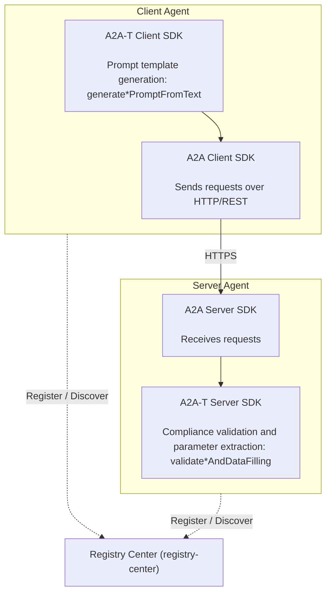
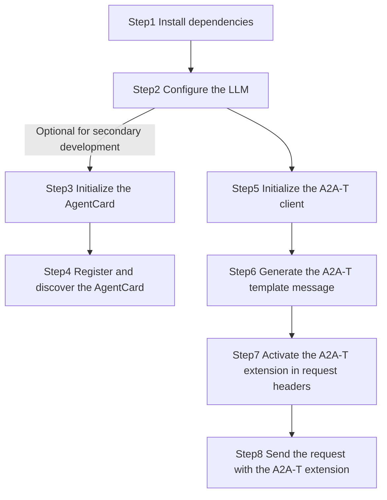
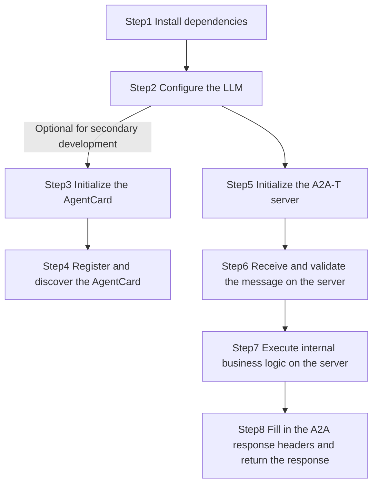

# 1 a2a-t-sdk-java Developer Guide

| Category | Description |
| -------- | ----------- |
| Target readers | Developers, integration and deployment engineers, and project delivery O&M personnel who build multi-agent protocol interactions on the A2A-T SDK |
| Document purpose | This document describes the complete installation, parameter configuration, and minimal practice of the A2A-T SDK. It helps users complete SDK integration, feature development, and production rollout quickly and to standard. |
| Prerequisites | Understand the data model definitions and usage of the A2A multi-agent protocol, understand the AgentCard model definition and usage, and understand registry center related functions |

## 1.1 Feature Introduction

### 1.1.1 A2A-T Capabilities
A2A-T (Agent-to-Agent Telecom) is a telecom-domain multi-agent interconnection protocol built on the A2A protocol, designed for complex collaboration scenarios in the telecom domain.

Business scenarios in the telecom domain are complex and demanding; the interconnection and collaboration of O&M agents require dedicated protocol support. Building on the A2A protocol, the A2A-T solution applies extensions focused on the information models, task negotiation, and collaboration security related to telecom-domain service flows.

a2a-t-sdk-java is a Java SDK for telecom agent collaboration scenarios. It generates, validates, and negotiates task prompts in A2A-T interactions. The SDK is suitable for integration by client agents, server agents, and upper-layer orchestration systems.

Main capabilities include:

- **Client-side template message generation**: the client generates protocol messages conforming to the A2A-T format from natural-language or structured input.
- **Server-side template message validation**: the server validates whether A2A-T protocol-format messages sent by the client match the scenario, template, and slot constraints.
- **Multi-round negotiation management**: supports the `information`, `feasibility`, and `target` negotiation flows.
- **Template resource management**: bundles scenario, slot, template, and system prompt resources, and supports both `classpath` and local-file resource loading.
- **LLM adaptation**: connects to external large models through OpenAI-compatible call chains.

For the API list and usage details provided by the SDK, see [API_Reference.md](API_Reference.md).

### 1.1.2 Relationship Between the A2A-T SDK and the A2A SDK

The A2A-T protocol is an extension of the A2A protocol. The A2A-T SDK is provided for the extended protocol content, supporting rapid construction of agents for complex collaboration scenarios in the telecom domain.

The A2A-T SDK is independent of the A2A SDK. By integrating both the A2A-T SDK and the A2A SDK, you can build agents that support the A2A-T protocol and achieve deterministic, highly reliable, efficient, and secure collaboration among multiple agents in the telecom domain. The A2A SDK to pair with in the Java ecosystem is a2a-java (`org.a2aproject.sdk`).



### 1.1.3 Typical Interaction Scenarios of the A2A-T SDK

A typical multi-agent collaboration interaction scenario involves at least three components: the client agent, the server agent, and the registry center.

The relationships between the components are shown below:




## 1.2 Constraints and Limitations

1. JDK 17+ is required, and the build tool must be Maven 3.8+.
2. Full multi-agent protocol interaction development requires the A2A official Java SDK (a2a-java, `org.a2aproject.sdk`) as well, with a version no lower than `1.0.0.Beta1`.
3. Prompt resources support two sources: `classpath` (default; loads the resources bundled in the `a2a-t-resources` jar) and `local_file` (local file resources).
4. Negotiation state storage provides only `in_memory`; the state is lost when the process exits.
5. The A2A-T SDK does not provide an agent HTTP service framework, a registry center client, authentication, or key management capabilities; these must be integrated by the business system.

## 1.3 Environment Preparation

### 1.3.1 Environment Requirements

| Item | Requirement |
| ---- | ----------- |
| Java | JDK 17+ |
| Build tool | Maven 3.8+ |
| LLM | An accessible OpenAI service and API key |
| Operating system | Linux, Windows, and macOS all work for development and joint debugging |

### 1.3.2 Setting Up the Environment

Taking a Windows 11 64-bit amd64 development environment as an example

**Install JDK 17**

1. Official download link: https://www.oracle.com/java/technologies/downloads/#java17 (Adoptium Temurin and other distributions also work: https://adoptium.net/temurin/releases/?version=17)

2. Download the Windows x64 Installer (`.msi` or `.exe`) and run it as administrator

3. During installation, select the option — or configure manually afterwards — to set the environment variables: `JAVA_HOME` points to the JDK installation directory, and `%JAVA_HOME%\bin` is added to `PATH`

4. After installation, open a terminal and run the verification command:

   ```shell
   java -version
   # Expected output: openjdk version "17.0.x" ...
   ```

**Install Maven**

1. Official download link: https://maven.apache.org/download.cgi. Download `apache-maven-3.9.x-bin.zip` and extract it to a local directory

2. Configure the environment variables: `MAVEN_HOME` points to the extracted directory, and `%MAVEN_HOME%\bin` is added to `PATH`

3. After installation, run the verification command:

   ```shell
   mvn -version
   # Expected output: Apache Maven 3.9.x
   ```

## 1.4 Basic Development Sample

Purpose: through sample code for the A2A-T client and server, this section helps users get familiar with the SDK integration process quickly and to standard, accelerating feature development and production rollout.

### 1.4.1 Sample API Description

This basic development sample mainly uses the following two A2A-T SDK APIs. In actual development, choose the appropriate APIs according to your business requirements:

**1. A2A-T Client SDK**

API definition and function description: generates a notification subscription prompt message from natural-language text with the specified Notification-T template (skipping scenario recognition). It runs one LLM slot-extraction step and then renders the template deterministically; the generation phase performs built-in slot schema validation.

```java
public MetadataContent generateNotificationPromptFromText(String text, TemplateUri templateUri)
```

Sample invocation:

```java
import java.nio.file.Path;
import net.openan.a2at.sdk.client.A2ATClient;
import net.openan.a2at.sdk.core.model.MetadataContent;
import net.openan.a2at.sdk.core.model.TemplateUri;

A2ATClient client = new A2ATClient(Path.of("client.env"));
TemplateUri templateUri = TemplateUri.parse("Notification-T/network-layer/service-recovery/v1").orElseThrow();

MetadataContent result = client.generateNotificationPromptFromText(
        "I would like to subscribe to service recovery events. The notification data format is as follows: "
                + "1. Service recovery plan execution status, possible values: not started, finished; "
                + "2. Complaint diagnosis task serial number; 3. OSS-side event serial number; 4. Access port name; "
                + "5. Whether OMC automatic recovery is authorized, possible values: yes, no; 6. Service recovery plan name; 7. Service recovery plan details",
        templateUri);

/* Output of the generated notification subscription prompt message (result.promptText(); the actual text varies with the LLM slot-extraction result)
## Subscription Description
Based on the following <Notification Topic>, <Subscribe Condition>, <Notification Data Format>, and <Expected Output> information, complete the subscription to and reporting of network-side service recovery events.

## Notification Topic
Service recovery event

## Subscribe Condition
(Optional)
1. Subnet name; e.g. xx subnet;

## Notification Data Format
1. Service recovery plan execution status, possible values: not started, finished
2. Complaint diagnosis task serial number
3. OSS-side event serial number
4. Access port name
5. Whether OMC automatic recovery is authorized, possible values: yes, no
6. Service recovery plan name
7. Service recovery plan details

## Expected Output
1. Subscription result, possible values: success, failure
2. Reason for subscription failure (optional)
3. After a successful subscription, report messages per the <Notification Data Format>
*/
```

**2. A2A-T Server SDK**

API definition and function description: validates whether a Notification-T notification subscription prompt message matches the template and slot constraints, and extracts parameters (subscription topic, subscription condition, notification data format, etc.) per the caller's schema.

```java
public FilledParamData validateNotificationPromptAndDataFilling(
        String prompt, Map<String, Object> schema, TemplateUri templateUri)
```

Sample invocation: validates the notification subscription message sent by the client and extracts the subscription parameters

```java
import java.nio.file.Path;
import java.util.List;
import java.util.Map;
import net.openan.a2at.sdk.core.model.FilledParamData;
import net.openan.a2at.sdk.core.model.TemplateUri;
import net.openan.a2at.sdk.server.A2ATServer;

A2ATServer server = new A2ATServer(Path.of("server.env"));
TemplateUri templateUri = TemplateUri.parse("Notification-T/network-layer/service-recovery/v1").orElseThrow();

Map<String, Object> validationSchema = Map.of(
        "type", "object",
        "properties", Map.of(
                "topic", Map.of("type", "string", "description", "Subscription topic (required). The name of the event topic to subscribe to."),
                "subscriptionCondition", Map.of(
                        "type", "string", "description", "Subscription condition (optional). The description of the condition to subscribe to."),
                "notificationDataFormat", Map.of(
                        "type", "string", "description", "Notification data format (required). The description of the notification data format to report.")),
        "required", List.of("topic", "notificationDataFormat"));

// promptText is the text of the notification subscription prompt message generated by the client (see the client sample invocation above)
FilledParamData result = server.validateNotificationPromptAndDataFilling(
        promptText, validationSchema, templateUri);

/* Subscription parameters extracted per the schema (result.data(); an empty subscription condition
   means the input in this example carries no subscription condition)
{
  topic=Service recovery event,
  subscriptionCondition=,
  notificationDataFormat=Service recovery event data includes: service recovery plan execution status (not started, finished), complaint diagnosis task serial number, OSS-side event serial number, access port name, whether OMC automatic recovery is authorized (yes, no), service recovery plan name, service recovery plan details.
}
*/
```

### 1.4.2 Development Workflow

- Client development workflow



> Secondary development means an agent has already been developed based on A2A and integrated with a registry center.

- Server development workflow:




### 1.4.3 Sample Client Development Steps

#### Step1 Install Dependencies

Business projects can use the BOM to manage A2A-T SDK versions uniformly:

```xml
<dependencyManagement>
    <dependencies>
        <dependency>
            <groupId>net.openan.a2a-t.sdk</groupId>
            <artifactId>a2a-t-bom</artifactId>
            <version>1.0.0</version>
            <type>pom</type>
            <scope>import</scope>
        </dependency>
    </dependencies>
</dependencyManagement>
```

Client agent dependencies:

```xml
<!-- A2A-T SDK -->
<dependency>
    <groupId>net.openan.a2a-t.sdk</groupId>
    <artifactId>a2a-t-client</artifactId>
</dependency>

<!-- A2A official Java SDK -->
<dependency>
    <groupId>org.a2aproject.sdk</groupId>
    <artifactId>a2a-java-sdk-client</artifactId>
    <version>1.0.0.Beta1</version>
</dependency>
<dependency>
    <groupId>org.a2aproject.sdk</groupId>
    <artifactId>a2a-java-sdk-client-transport-rest</artifactId>
    <version>1.0.0.Beta1</version>
</dependency>
```

> In the samples of this guide, A2A requests are uniformly sent through the A2A official Java SDK (the `Client` + REST transport of a2a-java).
>
> Only AgentCard registration and discovery with the registry center uses the JDK built-in `HttpClient` and Jackson (the registry center is outside the scope of a2a-java capabilities; business systems may replace them with any HTTP client and JSON library such as OkHttp or Spring RestTemplate). To use Jackson on the client, add:
>
> ```xml
> <dependency>
>  <groupId>com.fasterxml.jackson.core</groupId>
>  <artifactId>jackson-databind</artifactId>
>  <version>2.20.1</version>
> </dependency>
> ```

#### Step2 Configure the LLM

Copy the content of the `env.example` file in the repository root into `client.env` (`server.env` on the server side) and configure it as follows:

```properties
# Controls the language used by prompt runtime components.
A2AT_LANGUAGE=en-US

# Selects the prompt source backend (classpath | local_file).
A2AT_PROMPT_SOURCE_TYPE=classpath

# Required when A2AT_PROMPT_SOURCE_TYPE=local_file
A2AT_PROMPT_RESOURCE_LOCAL_ROOT_DIR=

# Selects the LLM provider used by the shared client.
A2AT_LLM_PROVIDER=openai

# Selects the default model name for the configured provider.
A2AT_LLM_MODEL=deepseek-chat

# API key for the configured LLM provider.
A2AT_LLM_API_KEY={your_llm_api_key}

# Base URL for the configured LLM provider.
A2AT_LLM_BASE_URL=https://api.deepseek.com

# Selects the negotiation state store implementation.
A2AT_NEGOTIATION_STATE_STORE_TYPE=in_memory

# Input limits
A2AT_INPUT_TEXT_MAX_CHARS=16384
```

> `A2AT_LLM_API_KEY` is the key used to **call the external large model**. Keep it safe.
>
> The SDK connects to external large models through OpenAI-compatible interfaces. `A2AT_LLM_PROVIDER` currently supports only `openai`; when connecting to OpenAI-compatible services such as DeepSeek, specify the service address with `A2AT_LLM_BASE_URL` and the model name with `A2AT_LLM_MODEL`.

#### Step3 Initialize the AgentCard

a2a-java officially recommends building the `AgentCard` (`org.a2aproject.sdk.spec.AgentCard`) with its Builder; you can declare the supported A2A-T templates in `capabilities.extensions`. When registering with the registry center, the AgentCard is serialized into JSON (wrapped as `{"agentCards": [...]}`).

- Reference client AgentCard definition (you can declare the supported A2A-T templates in `extensions`):

```java
import java.util.List;
import org.a2aproject.sdk.spec.AgentCapabilities;
import org.a2aproject.sdk.spec.AgentCard;
import org.a2aproject.sdk.spec.AgentExtension;
import org.a2aproject.sdk.spec.AgentInterface;
import org.a2aproject.sdk.spec.AgentProvider;
import org.a2aproject.sdk.spec.AgentSkill;

private static final String TASK_T_EXT_URI =
        "https://projects.tmforum.org/a2aproject/telecommunication/extensions/Task-T/v1";
private static final String NOTIFICATION_T_EXT_URI =
        "https://projects.tmforum.org/a2aproject/telecommunication/extensions/Notification-T/v1";

private static AgentCard buildClientAgentCard() {
    return AgentCard.builder()
            .name("Transmission workbench agent")
            .description("Transport network O&M management agent providing O&M capabilities such as circuit recovery verification, base station outage root cause analysis, and network element hidden danger inspection")
            .provider(new AgentProvider("ZzNode", "https://example.com"))
            .version("1.0.0")
            .capabilities(AgentCapabilities.builder()
                    .streaming(true)
                    .pushNotifications(false)
                    .extendedAgentCard(false)
                    .extensions(List.of(
                            AgentExtension.builder()
                                    .uri(TASK_T_EXT_URI)
                                    .description("Extension of structured prompt Task-T requests.")
                                    .build(),
                            AgentExtension.builder()
                                    .uri(NOTIFICATION_T_EXT_URI)
                                    .description("Extension of structured prompt Notification-T requests.")
                                    .build()))
                    .build())
            .defaultInputModes(List.of("application/json", "text/plain"))
            .defaultOutputModes(List.of("application/json", "text/plain"))
            .skills(List.of(
                    AgentSkill.builder()
                            .id("circuit-recovery-verification")
                            .name("Circuit recovery verification agent")
                            .description("Circuit service recovery verification skill. Substitutes the circuit name in the request into a fixed JSON template and returns the service recovery verification result. Used when the user mentions \"service recovery verification\", \"circuit recovery verification\", \"circuit recovery verification\", or similar requests. Applicable to scenarios that need to confirm the service recovery status of a specified circuit.")
                            .tags(List.of("circuit recovery verification", "service recovery verification", "circuit-recovery"))
                            .examples(List.of(
                                    "Verify service recovery for circuits: LYSPELC3, SN3 Phase 2 - LYXLSJLT1 Building 10GE1049641NR",
                                    "Verify service recovery for circuit XXX",
                                    "circuit recovery verification for circuit XXX"))
                            .inputModes(List.of("application/json", "text/plain"))
                            .outputModes(List.of("application/json", "text/plain"))
                            .build(),
                    AgentSkill.builder()
                            .id("ne-hidden-danger")
                            .name("NE hidden danger inspection agent")
                            .description("Network element hidden danger inspection skill. Inspects whether the specified network element still has new hidden dangers based on the input network element name. Used when the user mentions \"hidden danger inspection\", \"check hidden dangers\", \"NE inspection\", \"ne hidden danger\", or similar requests. Applicable to scenarios that need to check the hidden danger status of a specified network element.")
                            .tags(List.of("NE inspection", "hidden danger inspection", "NE-inspection"))
                            .examples(List.of(
                                    "Check whether NE QZHA-HAZBYSDGG-HRHH still produces new hidden dangers",
                                    "Check whether NE XXX still has hidden dangers",
                                    "Check if NE XXX has any hidden dangers"))
                            .inputModes(List.of("application/json", "text/plain"))
                            .outputModes(List.of("application/json", "text/plain"))
                            .build()))
            .supportedInterfaces(List.of(
                    new AgentInterface("HTTP+JSON", "http://10.xx.xx.xx:26335/a2a/v1", "", "1.0")))
            .build();
}
```

- Reference client AgentCard JSON message:

```json
{
  "agentCards": [
    {
      "name": "Transmission workbench agent",
      "description": "Transport network O&M management agent providing O&M capabilities such as circuit recovery verification, base station outage root cause analysis, and network element hidden danger inspection",
      "supportedInterfaces": [
        {
          "url": "http://10.xx.xx.xx:26335/a2a/v1",
          "protocolBinding": "HTTP+JSON",
          "protocolVersion": "1.0"
        }
      ],
      "provider": {
        "organization": "ZzNode"
      },
      "version": "1.0.0",
      "capabilities": {
        "streaming": true,
        "pushNotifications": false,
        "extensions": [
          {
            "uri": "https://projects.tmforum.org/a2aproject/telecommunication/extensions/Task-T/v1",
            "description": "Extension of structured prompt Task-T requests."
          },
          {
            "uri": "https://projects.tmforum.org/a2aproject/telecommunication/extensions/Notification-T/v1",
            "description": "Extension of structured prompt Notification-T requests."
          }
        ],
        "extendedAgentCard": false
      },
      "securitySchemes": {
        "bearerAuth": {
          "httpAuthSecurityScheme": {
            "description": "Query the accessSession through the login API with the username and password, and then use the accessSession for bearer authentication.",
            "scheme": "Bearer"
          }
        }
      },
      "defaultInputModes": [
        "application/json",
        "text/plain"
      ],
      "defaultOutputModes": [
        "application/json",
        "text/plain"
      ],
      "skills": [
        {
          "id": "circuit-recovery-verification",
          "name": "Circuit recovery verification agent",
          "description": "Circuit service recovery verification skill. Substitutes the circuit name in the request into a fixed JSON template and returns the service recovery verification result. Used when the user mentions \"service recovery verification\", \"circuit recovery verification\", \"circuit recovery verification\", or similar requests. Applicable to scenarios that need to confirm the service recovery status of a specified circuit.",
          "tags": [
            "circuit recovery verification",
            "service recovery verification",
            "circuit-recovery"
          ],
          "examples": [
            "Verify service recovery for circuits: LYSPELC3, SN3 Phase 2 - LYXLSJLT1 Building 10GE1049641NR",
            "Verify service recovery for circuit XXX",
            "circuit recovery verification for circuit XXX"
          ],
          "inputModes": [
            "application/json",
            "text/plain"
          ],
          "outputModes": [
            "application/json",
            "text/plain"
          ]
        },
        {
          "id": "ne-hidden-danger",
          "name": "NE hidden danger inspection agent",
          "description": "Network element hidden danger inspection skill. Inspects whether the specified network element still has new hidden dangers based on the input network element name. Used when the user mentions \"hidden danger inspection\", \"check hidden dangers\", \"NE inspection\", \"ne hidden danger\", or similar requests. Applicable to scenarios that need to check the hidden danger status of a specified network element.",
          "tags": [
            "NE inspection",
            "hidden danger inspection",
            "NE-inspection"
          ],
          "examples": [
            "Check whether NE QZHA-HAZBYSDGG-HRHH still produces new hidden dangers",
            "Check whether NE XXX still has hidden dangers",
            "Check if NE XXX has any hidden dangers"
          ],
          "inputModes": [
            "application/json",
            "text/plain"
          ],
          "outputModes": [
            "application/json",
            "text/plain"
          ]
        }
      ]
    }
  ]
}
```

#### Step4 Register and Discover the AgentCard

- **AgentCard registration**: publish the client AgentCard to the registry center. The address and URI of the registry center depend on the actual deployment

```java
import java.net.URI;
import java.net.http.HttpClient;
import java.net.http.HttpRequest;
import java.net.http.HttpResponse;
import java.util.List;
import java.util.Map;
import com.fasterxml.jackson.annotation.JsonInclude;
import com.fasterxml.jackson.databind.ObjectMapper;
import org.a2aproject.sdk.spec.AgentCard;

private static final HttpClient HTTP_CLIENT = HttpClient.newHttpClient();
private static final ObjectMapper MAPPER = new ObjectMapper().setSerializationInclusion(JsonInclude.Include.NON_NULL);

private static void registerAgentCard(String registryBaseUrl, AgentCard agentCard)
        throws Exception {
    String payload = MAPPER.writeValueAsString(Map.of("agentCards", List.of(agentCard)));
    HttpRequest request = HttpRequest.newBuilder()
            .uri(URI.create(registryBaseUrl + "/rest/v1/registry-center/agent-cards"))
            .header("Content-Type", "application/json")
            .POST(HttpRequest.BodyPublishers.ofString(payload))
            .build();
    HttpResponse<String> response = HTTP_CLIENT.send(request, HttpResponse.BodyHandlers.ofString());
    if (response.statusCode() != 201) {
        throw new IllegalStateException("AgentCard registration failed: " + response.statusCode());
    }
}
```

- **AgentCard discovery**: query the registry center by the target agent name or skill to obtain its AgentCard, and thereby the `url` and supported skills

```java
import java.util.List;
import java.util.Map;
import com.fasterxml.jackson.core.type.TypeReference;

private static Map<String, Object> discoverAgent(
        String registryBaseUrl, String organization, String name) throws Exception {
    HttpRequest request = HttpRequest.newBuilder()
            .uri(URI.create(registryBaseUrl + "/rest/v1/registry-center/agent-cards/"
                    + organization + "/" + name))
            .GET()
            .build();
    HttpResponse<String> response = HTTP_CLIENT.send(request, HttpResponse.BodyHandlers.ofString());
    if (response.statusCode() >= 400) {
        throw new IllegalStateException("AgentCard query failed: " + response.statusCode());
    }
    Map<String, Object> payload =
            MAPPER.readValue(response.body(), new TypeReference<Map<String, Object>>() {});
    return (Map<String, Object>) ((List<?>) payload.get("agentCards")).get(0);
}
```

The discovery result is the JSON structure returned by the registry center. Because a2a-java's `Client.builder(...)` takes an `org.a2aproject.sdk.spec.AgentCard` object, convert it into the official AgentCard model:

```java
import java.util.List;
import java.util.Map;
import org.a2aproject.sdk.spec.AgentCapabilities;
import org.a2aproject.sdk.spec.AgentCard;
import org.a2aproject.sdk.spec.AgentExtension;
import org.a2aproject.sdk.spec.AgentInterface;
import org.a2aproject.sdk.spec.AgentProvider;
import org.a2aproject.sdk.spec.AgentSkill;

@SuppressWarnings("unchecked")
private static AgentCard toAgentCard(Map<String, Object> registryAgentCard) {
    Map<String, Object> provider = (Map<String, Object>) registryAgentCard.getOrDefault("provider", Map.of());
    Map<String, Object> capabilities = (Map<String, Object>) registryAgentCard.getOrDefault("capabilities", Map.of());
    List<Map<String, Object>> extensionMaps =
            (List<Map<String, Object>>) capabilities.getOrDefault("extensions", List.of());
    List<Map<String, Object>> skillMaps =
            (List<Map<String, Object>>) registryAgentCard.getOrDefault("skills", List.of());
    List<Map<String, Object>> interfaceMaps =
            (List<Map<String, Object>>) registryAgentCard.getOrDefault("supportedInterfaces", List.of());

    return AgentCard.builder()
            .name(string(registryAgentCard.get("name")))
            .description(string(registryAgentCard.get("description")))
            .provider(new AgentProvider(string(provider.get("organization")), string(provider.get("url"))))
            .version(string(registryAgentCard.get("version")))
            .capabilities(AgentCapabilities.builder()
                    .streaming(Boolean.TRUE.equals(capabilities.get("streaming")))
                    .pushNotifications(Boolean.TRUE.equals(capabilities.get("pushNotifications")))
                    .extendedAgentCard(Boolean.TRUE.equals(capabilities.get("extendedAgentCard")))
                    .extensions(extensionMaps.stream()
                            .map(extension -> AgentExtension.builder()
                                    .uri(string(extension.get("uri")))
                                    .description(string(extension.get("description")))
                                    .required(Boolean.TRUE.equals(extension.get("required")))
                                    .build())
                            .toList())
                    .build())
            .defaultInputModes(stringList(registryAgentCard.get("defaultInputModes")))
            .defaultOutputModes(stringList(registryAgentCard.get("defaultOutputModes")))
            .skills(skillMaps.stream()
                    .map(skill -> AgentSkill.builder()
                            .id(string(skill.get("id")))
                            .name(string(skill.get("name")))
                            .description(string(skill.get("description")))
                            .tags(stringList(skill.get("tags")))
                            .build())
                    .toList())
            .supportedInterfaces(interfaceMaps.stream()
                    .map(agentInterface -> new AgentInterface(
                            string(agentInterface.get("protocolBinding")),
                            string(agentInterface.get("url")),
                            string(agentInterface.getOrDefault("tenant", "")),
                            string(agentInterface.getOrDefault("protocolVersion", "1.0"))))
                    .toList())
            .build();
}

private static String string(Object value) {
    return value == null ? "" : String.valueOf(value);
}

private static List<String> stringList(Object value) {
    return value instanceof List<?> values ? values.stream().map(String::valueOf).toList() : List.of();
}
```

#### Step5 Initialize the A2A-T Client

```java
import java.nio.file.Path;
import net.openan.a2at.sdk.client.A2ATClient;

A2ATClient client = new A2ATClient(Path.of("client.env"));
```

Both `A2ATClient` and `A2ATServer` take the `.env` file path explicitly at construction (the Java SDK does not auto-discover configuration files); the path is resolved against the process working directory, so an absolute path is recommended.

#### Step6 Generate the A2A-T Template Message

The client uses the A2A-T Client SDK API `generateNotificationPromptFromText` to generate the Notification-T subscription message (processed_prompt), and then sends it to the target agent as part of an A2A message.

```java
import java.nio.file.Path;
import net.openan.a2at.sdk.client.A2ATClient;
import net.openan.a2at.sdk.core.model.MetadataContent;
import net.openan.a2at.sdk.core.model.TemplateUri;

A2ATClient client = new A2ATClient(Path.of("client.env"));

// Generate the A2A-T notification subscription prompt message
// (on generation failure a PromptGenerationException is thrown, carrying code and message)
TemplateUri templateUri =
        TemplateUri.parse("Notification-T/network-layer/service-recovery/v1").orElseThrow();
MetadataContent result = client.generateNotificationPromptFromText(
        "I would like to subscribe to service recovery events. The notification data format is as follows: "
                + "1. Service recovery plan execution status, possible values: not started, finished; "
                + "2. Complaint diagnosis task serial number; 3. OSS-side event serial number; 4. Access port name; "
                + "5. Whether OMC automatic recovery is authorized, possible values: yes, no; 6. Service recovery plan name; 7. Service recovery plan details",
        templateUri);

String processedPrompt = result.promptText();
String extensionUri = result.extensionUri();  // A2A-T extension URI, used for message metadata and request headers
```

#### Step7 Activate the A2A-T Extension in Request Headers

The A2A protocol conveys the protocol version and extension declarations through HTTP headers. The following headers are required:

| Header | Direction | Required | Value |
| ------ | --------- | -------- | ----- |
| `A2A-Version` | Request header | Yes | Protocol version, e.g. `1.0` (the client must carry it with every request) |
| `A2A-Extensions` | Request header | Required when using A2A-T | Comma-separated list of extension URIs, declaring the extensions used by this request |

Sample of filling in client request headers: when sending requests with a2a-java, `A2A-Extensions` is passed in through the headers of `ClientCallContext` (protocol headers such as the protocol version are carried by the a2a-java transport layer as required by the protocol)

```java
import java.util.Map;
import org.a2aproject.sdk.client.transport.spi.interceptors.ClientCallContext;

String notificationPromptExt = "https://projects.tmforum.org/a2aproject/telecommunication/extensions/Notification-T/v1";

ClientCallContext callContext =
        new ClientCallContext(Map.of(), Map.of("A2A-Extensions", notificationPromptExt));
```

#### Step8 Send the Request with the A2A-T Extension

Send the request using the official a2a-java SDK: put the processed prompt into `Message.metadata` (keyed by the extension URI), declare the request headers through `ClientCallContext`, and send it with `Client` over the REST transport.

```java
import java.nio.file.Path;
import java.util.List;
import java.util.Map;
import java.util.UUID;
import java.util.concurrent.CountDownLatch;
import net.openan.a2at.sdk.client.A2ATClient;
import net.openan.a2at.sdk.core.model.MetadataContent;
import net.openan.a2at.sdk.core.model.TemplateUri;
import org.a2aproject.sdk.client.Client;
import org.a2aproject.sdk.client.ClientEvent;
import org.a2aproject.sdk.client.MessageEvent;
import org.a2aproject.sdk.client.TaskUpdateEvent;
import org.a2aproject.sdk.client.transport.rest.RestTransport;
import org.a2aproject.sdk.client.transport.rest.RestTransportConfig;
import org.a2aproject.sdk.client.transport.spi.interceptors.ClientCallContext;
import org.a2aproject.sdk.spec.AgentCard;
import org.a2aproject.sdk.spec.Message;
import org.a2aproject.sdk.spec.MessageSendParams;
import org.a2aproject.sdk.spec.TaskArtifactUpdateEvent;
import org.a2aproject.sdk.spec.TaskStatusUpdateEvent;
import org.a2aproject.sdk.spec.TextPart;

String notificationPromptExt = "https://projects.tmforum.org/a2aproject/telecommunication/extensions/Notification-T/v1";

// 1) Generate the A2A-T template message (see 1.4.3 Step6)
A2ATClient client = new A2ATClient(Path.of("client.env"));
TemplateUri templateUri =
        TemplateUri.parse("Notification-T/network-layer/service-recovery/v1").orElseThrow();
MetadataContent result = client.generateNotificationPromptFromText(
        "I would like to subscribe to service recovery events. The notification data format is as follows: "
                + "1. Service recovery plan execution status, possible values: not started, finished; "
                + "2. Complaint diagnosis task serial number; 3. OSS-side event serial number; 4. Access port name; "
                + "5. Whether OMC automatic recovery is authorized, possible values: yes, no; 6. Service recovery plan name; 7. Service recovery plan details",
        templateUri);
String processedPrompt = result.promptText();

// 2) Build the A2A message carrying the A2A-T extension (the prompt goes into metadata, keyed by the extension URI)
Message message = Message.builder()
        .messageId(UUID.randomUUID().toString())
        .role(Message.Role.ROLE_USER)
        .parts(new TextPart("I would like to subscribe to service recovery events"))
        .metadata(Map.of(notificationPromptExt, processedPrompt))
        .build();
MessageSendParams params = MessageSendParams.builder().message(message).build();

// 3) Declare the A2A-T extension request header through ClientCallContext (see 1.4.3 Step7)
ClientCallContext callContext =
        new ClientCallContext(Map.of(), Map.of("A2A-Extensions", notificationPromptExt));

// 4) Send the request with the a2a-java Client and consume task events
CountDownLatch done = new CountDownLatch(1);
try (Client a2aClient = Client.builder(agentCard)
        .withTransport(RestTransport.class, new RestTransportConfig())
        .build()) {
    a2aClient.sendMessage(
            params,
            List.of((event, ignored) -> handleEvent(event, done)),
            throwable -> {
                throwable.printStackTrace();
                done.countDown();
            },
            callContext);
    // When the AgentCard declares streaming=true, message:stream streaming is used: sendMessage returns
    // immediately and we wait for the task to reach a terminal state; otherwise message:send blocking mode
    // is used and the task has already finished when sendMessage returns
    done.await();
}

private static void handleEvent(ClientEvent event, CountDownLatch done) {
    if (event instanceof TaskUpdateEvent update) {
        if (update.getUpdateEvent() instanceof TaskStatusUpdateEvent statusUpdate) {
            System.out.println("task-status: " + statusUpdate.status().state());
            if (statusUpdate.status().state().isFinal()) {
                done.countDown();
            }
        } else if (update.getUpdateEvent() instanceof TaskArtifactUpdateEvent artifactUpdate) {
            System.out.println("task-artifact: " + artifactUpdate.artifact().parts());
        }
    } else if (event instanceof MessageEvent messageEvent) {
        System.out.println("task-message: " + messageEvent.getMessage().parts());
    }
}
```

#### Complete Sample Client Code

```java
import java.net.URI;
import java.net.http.HttpClient;
import java.net.http.HttpRequest;
import java.net.http.HttpResponse;
import java.nio.file.Path;
import java.util.List;
import java.util.Map;
import java.util.UUID;
import java.util.concurrent.CountDownLatch;
import com.fasterxml.jackson.annotation.JsonInclude;
import com.fasterxml.jackson.core.type.TypeReference;
import com.fasterxml.jackson.databind.ObjectMapper;
import net.openan.a2at.sdk.client.A2ATClient;
import net.openan.a2at.sdk.core.model.MetadataContent;
import net.openan.a2at.sdk.core.model.TemplateUri;
import org.a2aproject.sdk.client.Client;
import org.a2aproject.sdk.client.ClientEvent;
import org.a2aproject.sdk.client.MessageEvent;
import org.a2aproject.sdk.client.TaskUpdateEvent;
import org.a2aproject.sdk.client.transport.rest.RestTransport;
import org.a2aproject.sdk.client.transport.rest.RestTransportConfig;
import org.a2aproject.sdk.client.transport.spi.interceptors.ClientCallContext;
import org.a2aproject.sdk.spec.AgentCard;
import org.a2aproject.sdk.spec.Message;
import org.a2aproject.sdk.spec.MessageSendParams;
import org.a2aproject.sdk.spec.TaskArtifactUpdateEvent;
import org.a2aproject.sdk.spec.TaskStatusUpdateEvent;
import org.a2aproject.sdk.spec.TextPart;

public final class ClientSample {
    private static final String NOTIFICATION_T_EXT_URI =
            "https://projects.tmforum.org/a2aproject/telecommunication/extensions/Notification-T/v1";

    private static final ObjectMapper MAPPER = new ObjectMapper().setSerializationInclusion(JsonInclude.Include.NON_NULL);
    private static final HttpClient HTTP_CLIENT = HttpClient.newHttpClient();

    public static void main(String[] args) throws Exception {
        // 1) Register the client AgentCard and discover the server AgentCard
        registerAgentCard("http://{ip:port}", buildClientAgentCard());  // the client AgentCard defined in 1.4.3 Step3
        AgentCard serverAgentCard = toAgentCard(
                discoverAgent("http://{ip:port}", "Huawei", "RAN Domain Agent"));

        // 2) Use the SDK capability to generate the A2A-T notification subscription prompt message
        A2ATClient client = new A2ATClient(Path.of("client.env"));
        TemplateUri templateUri =
                TemplateUri.parse("Notification-T/network-layer/service-recovery/v1").orElseThrow();
        MetadataContent result = client.generateNotificationPromptFromText(
                "I would like to subscribe to service recovery events. The notification data format is as follows: "
                        + "1. Service recovery plan execution status, possible values: not started, finished; "
                        + "2. Complaint diagnosis task serial number; 3. OSS-side event serial number; 4. Access port name; "
                        + "5. Whether OMC automatic recovery is authorized, possible values: yes, no; 6. Service recovery plan name; 7. Service recovery plan details",
                templateUri);
        String processedPrompt = result.promptText();

        // 3) Build the A2A message carrying the A2A-T extension (request headers declare the extension; the message body carries the A2A-T extension field)
        Message message = Message.builder()
                .messageId(UUID.randomUUID().toString())
                .role(Message.Role.ROLE_USER)
                .parts(new TextPart("I would like to subscribe to service recovery events"))
                .metadata(Map.of(NOTIFICATION_T_EXT_URI, processedPrompt))
                .build();
        MessageSendParams params = MessageSendParams.builder().message(message).build();
        ClientCallContext callContext =
                new ClientCallContext(Map.of(), Map.of("A2A-Extensions", NOTIFICATION_T_EXT_URI));

        // 4) Send the request with the a2a-java Client and consume task events
        CountDownLatch done = new CountDownLatch(1);
        try (Client a2aClient = Client.builder(serverAgentCard)
                .withTransport(RestTransport.class, new RestTransportConfig())
                .build()) {
            a2aClient.sendMessage(
                    params,
                    List.of((event, ignored) -> handleEvent(event, done)),
                    throwable -> {
                        throwable.printStackTrace();
                        done.countDown();
                    },
                    callContext);
            done.await();  // In streaming mode, wait for the task to reach a terminal state
        }
    }

    private static void handleEvent(ClientEvent event, CountDownLatch done) {
        if (event instanceof TaskUpdateEvent update) {
            if (update.getUpdateEvent() instanceof TaskStatusUpdateEvent statusUpdate) {
                System.out.println("task-status: " + statusUpdate.status().state());
                if (statusUpdate.status().state().isFinal()) {
                    done.countDown();
                }
            } else if (update.getUpdateEvent() instanceof TaskArtifactUpdateEvent artifactUpdate) {
                System.out.println("task-artifact: " + artifactUpdate.artifact().parts());
            }
        } else if (event instanceof MessageEvent messageEvent) {
            System.out.println("task-message: " + messageEvent.getMessage().parts());
        }
    }

    private static void registerAgentCard(String registryBaseUrl, AgentCard agentCard)
            throws Exception {
        String payload = MAPPER.writeValueAsString(Map.of("agentCards", List.of(agentCard)));
        HttpRequest request = HttpRequest.newBuilder()
                .uri(URI.create(registryBaseUrl + "/rest/v1/registry-center/agent-cards"))
                .header("Content-Type", "application/json")
                .POST(HttpRequest.BodyPublishers.ofString(payload))
                .build();
        HttpResponse<String> response = HTTP_CLIENT.send(request, HttpResponse.BodyHandlers.ofString());
        if (response.statusCode() != 201) {
            throw new IllegalStateException("AgentCard registration failed: " + response.statusCode());
        }
    }

    private static Map<String, Object> discoverAgent(
            String registryBaseUrl, String organization, String name) throws Exception {
        HttpRequest request = HttpRequest.newBuilder()
                .uri(URI.create(registryBaseUrl + "/rest/v1/registry-center/agent-cards/"
                        + organization + "/" + name))
                .GET()
                .build();
        HttpResponse<String> response = HTTP_CLIENT.send(request, HttpResponse.BodyHandlers.ofString());
        if (response.statusCode() >= 400) {
            throw new IllegalStateException("AgentCard query failed: " + response.statusCode());
        }
        Map<String, Object> payload =
                MAPPER.readValue(response.body(), new TypeReference<Map<String, Object>>() {});
        return (Map<String, Object>) ((List<?>) payload.get("agentCards")).get(0);
    }
}
```

> `buildClientAgentCard()`, `toAgentCard(Map)`, and the `string`/`stringList` helper methods are defined in Step3 and Step4.

### 1.4.4 Sample Server Development Steps

#### Step1-Step5 Prerequisites

Steps such as installing dependencies and configuring the LLM can all reference the [client implementation](#143-sample-client-development-steps). The differences are as follows:

It is recommended that the server agent use the official a2a-java REST reference server (based on Quarkus, which automatically assembles the REST transport, task management, and event queues) to host A2A requests. Add the following dependencies:

```xml
<!-- A2A-T SDK -->
<dependency>
    <groupId>net.openan.a2a-t.sdk</groupId>
    <artifactId>a2a-t-server</artifactId>
</dependency>

<!-- A2A official Java SDK: REST reference server (Quarkus based) -->
<dependency>
    <groupId>org.a2aproject.sdk</groupId>
    <artifactId>a2a-java-sdk-reference-rest</artifactId>
    <version>1.0.0.Beta1</version>
</dependency>

<!-- JSON serialization used for registry center interaction (replaceable with any JSON library) -->
<dependency>
    <groupId>com.fasterxml.jackson.core</groupId>
    <artifactId>jackson-databind</artifactId>
    <version>2.20.1</version>
</dependency>
```

A Quarkus project also needs the Quarkus platform BOM and build plugin (for a complete project scaffold, refer to the official a2a-java [Server Guide](https://a2aproject.github.io/a2a-java/) or generate one at https://code.quarkus.io):

```xml
<properties>
    <quarkus.platform.version>3.30.6</quarkus.platform.version>
</properties>

<dependencyManagement>
    <dependencies>
        <!-- A2A-T SDK BOM (see Step1) -->
        <dependency>
            <groupId>io.quarkus.platform</groupId>
            <artifactId>quarkus-bom</artifactId>
            <version>${quarkus.platform.version}</version>
            <type>pom</type>
            <scope>import</scope>
        </dependency>
    </dependencies>
</dependencyManagement>

<build>
    <plugins>
        <plugin>
            <groupId>io.quarkus.platform</groupId>
            <artifactId>quarkus-maven-plugin</artifactId>
            <version>${quarkus.platform.version}</version>
            <extensions>true</extensions>
            <executions>
                <execution>
                    <goals>
                        <goal>build</goal>
                        <goal>generate-code</goal>
                        <goal>generate-code-tests</goal>
                    </goals>
                </execution>
            </executions>
        </plugin>
    </plugins>
</build>
```

- Initialize the A2A-T server

```java
import java.nio.file.Path;
import net.openan.a2at.sdk.server.A2ATServer;

A2ATServer server = new A2ATServer(Path.of("server.env"));
```

- Initialize the AgentCard: a2a-java officially recommends exposing the AgentCard qualified with `@PublicAgentCard` through a CDI producer (built with the Builder; see 1.4.3 Step3 for the construction approach). Reference server AgentCard definition:

```java
import java.util.List;
import org.a2aproject.sdk.spec.AgentCapabilities;
import org.a2aproject.sdk.spec.AgentCard;
import org.a2aproject.sdk.spec.AgentExtension;
import org.a2aproject.sdk.spec.AgentInterface;
import org.a2aproject.sdk.spec.AgentProvider;
import org.a2aproject.sdk.spec.AgentSkill;

private static final String TASK_T_EXT_URI =
        "https://projects.tmforum.org/a2aproject/telecommunication/extensions/Task-T/v1";
private static final String NOTIFICATION_T_EXT_URI =
        "https://projects.tmforum.org/a2aproject/telecommunication/extensions/Notification-T/v1";

private static AgentCard buildServerAgentCard() {
    return AgentCard.builder()
            .name("RAN Domain Agent")
            .description("RAN Domain Agent")
            .provider(new AgentProvider("Huawei", "https://www.huawei.com"))
            .version("1.0.0")
            .capabilities(AgentCapabilities.builder()
                    .streaming(true)
                    .pushNotifications(false)
                    .extendedAgentCard(false)
                    .extensions(List.of(
                            AgentExtension.builder()
                                    .uri(TASK_T_EXT_URI)
                                    .description("Extension of structured prompt TASK-T requests.")
                                    .required(false)
                                    .build(),
                            AgentExtension.builder()
                                    .uri(NOTIFICATION_T_EXT_URI)
                                    .description("Extension of structured prompt Notification-T requests.")
                                    .required(false)
                                    .build()))
                    .build())
            .defaultInputModes(List.of("application/json", "text/plain"))
            .defaultOutputModes(List.of("application/json", "text/plain"))
            .skills(List.of(AgentSkill.builder()
                    .id("ran-incident-subscription")
                    .name("Incident Reporting")
                    .description("Supports Incident reporting and provides intelligent fault identification and diagnosis capabilities")
                    .tags(List.of("Incident Reporting"))
                    .examples(List.of(
                            "## Subscription Description\nBased on the following <Notification Topic>, <Subscribe Condition>, <Notification Data Format>, and <Expected Output> information, complete the network-side intelligent fault Incident subscription and reporting task.\n## Notification Topic\nThe name of this topic is \"incident\"\n## Subscribe Condition\nFault level is \"high\"\n## Notification Data Format\nReport Incident data via DataPart\n## Expected Output\n1. Subscription result, success or failure\n2. Reason for subscription failure (optional)"))
                    .build()))
            // The URL ends with "/"; a2a-java RestTransport appends message:send / message:stream to it
            .supportedInterfaces(List.of(
                    new AgentInterface("HTTP+JSON", "http://127.0.0.1:26335/", "", "1.0")))
            .build();
}
```

- Reference server AgentCard JSON message:

```json
{
  "agentCards": [
    {
      "name": "RAN Domain Agent",
      "description": "RAN Domain Agent",
      "provider": {
        "organization": "Huawei",
        "url": "https://www.huawei.com"
      },
      "version": "1.0.0",
      "capabilities": {
        "streaming": true,
        "pushNotifications": false,
        "extendedAgentCard": false,
        "extensions": [
          {
            "description": "Extension of structured prompt TASK-T requests.",
            "required": false,
            "uri": "https://projects.tmforum.org/a2aproject/telecommunication/extensions/Task-T/v1"
          },
          {
            "description": "Extension of structured prompt Notification-T requests.",
            "required": false,
            "uri": "https://projects.tmforum.org/a2aproject/telecommunication/extensions/Notification-T/v1"
          }
        ]
      },
      "defaultInputModes": [
        "application/json",
        "text/plain"
      ],
      "defaultOutputModes": [
        "application/json",
        "text/plain"
      ],
      "skills": [
        {
          "id": "ran-incident-subscription",
          "name": "Incident Reporting",
          "description": "Supports Incident reporting and provides intelligent fault identification and diagnosis capabilities",
          "tags": [
            "Incident Reporting"
          ],
          "examples": [
            "## Subscription Description\\nBased on the following \<Notification Topic\>, \<Subscribe Condition\>, \<Notification Data Format\>, and \<Expected Output\> information, complete the network-side intelligent fault Incident subscription and reporting task.\\n## Notification Topic\\nThe name of this topic is \\\"incident\\\"\\n## Subscribe Condition\\nFault level is \\\"high\\\"\\n## Notification Data Format\\nReport Incident data via DataPart\\n## Expected Output\\n1. Subscription result, success or failure\\n2. Reason for subscription failure (optional)"
          ],
          "inputModes": [
            "application/json",
            "text/plain"
          ],
          "outputModes": [
            "application/json",
            "text/plain"
          ]
        }
      ],
      "securitySchemes": {
        "bearerAuth": {
          "httpAuthSecurityScheme": {
            "scheme": "Bearer",
            "description": "Query the accessSession through the login API with the username and password, and then use the accessSession for bearer authentication."
          }
        }
      },
      "securityRequirements": [],
      "supportedInterfaces": [
        {
          "protocolBinding": "JSONRPC",
          "url": "https://10.xx.xx.xx:27417/a2a/v1",
          "tenant": "",
          "protocolVersion": "1.0"
        },
        {
          "protocolBinding": "HTTP+JSON",
          "url": "https://10.xx.xx.xx:27417/a2a/json",
          "tenant": "",
          "protocolVersion": "1.0"
        }
      ]
    }
  ]
}
```

#### Step6-Step7 Receive and Validate the Message on the Server

When the server is hosted by a2a-java, protocol parsing, task creation, and event queue management are handled by the SDK. The business side implements the official `AgentExecutor` interface: in the `execute` callback, take the Notification-T subscription message out of the message `metadata` field (keyed by the extension URI), pass it to `A2ATServer.validateNotificationPromptAndDataFilling` for validation and subscription-parameter extraction, and push task status and result events through `AgentEmitter`:

```java
import java.util.List;
import java.util.Map;
import java.util.UUID;
import net.openan.a2at.sdk.core.model.FilledParamData;
import net.openan.a2at.sdk.core.model.TemplateUri;
import net.openan.a2at.sdk.core.validation.ContentValidationException;
import net.openan.a2at.sdk.server.A2ATServer;
import org.a2aproject.sdk.server.agentexecution.AgentExecutor;
import org.a2aproject.sdk.server.agentexecution.RequestContext;
import org.a2aproject.sdk.server.tasks.AgentEmitter;
import org.a2aproject.sdk.spec.A2AError;
import org.a2aproject.sdk.spec.DataPart;
import org.a2aproject.sdk.spec.Message;
import org.a2aproject.sdk.spec.TextPart;

public final class ServiceRecoverySubscriptionExecutor implements AgentExecutor {

    private static final String NOTIFICATION_T_EXT_URI =
            "https://projects.tmforum.org/a2aproject/telecommunication/extensions/Notification-T/v1";

    private static final TemplateUri NOTIFICATION_TEMPLATE_URI =
            TemplateUri.parse("Notification-T/network-layer/service-recovery/v1").orElseThrow();

    private static final Map<String, Object> NOTIFICATION_PARAM_SCHEMA = Map.of(
            "type", "object",
            "properties", Map.of(
                    "topic", Map.of("type", "string", "description", "Subscription topic (required). The name of the event topic to subscribe to."),
                    "subscriptionCondition", Map.of(
                            "type", "string", "description", "Subscription condition (optional). The description of the condition to subscribe to."),
                    "notificationDataFormat", Map.of(
                            "type", "string", "description", "Notification data format (required). The description of the notification data format to report.")),
            "required", List.of("topic", "notificationDataFormat"));

    private final A2ATServer server;

    public ServiceRecoverySubscriptionExecutor(A2ATServer server) {
        this.server = server;
    }

    @Override
    public void execute(RequestContext requestContext, AgentEmitter agentEmitter) throws A2AError {
        // 1) Take the A2A-T extension message out of the message metadata (keyed by the extension URI)
        String processedPrompt = extractPrompt(requestContext.getMessage());
        if (processedPrompt.isBlank()) {
            agentEmitter.reject(statusMessage(requestContext, "missing A2A-T notification prompt"));
            return;
        }
        agentEmitter.submit(statusMessage(requestContext,
                "Subscription accepted, starting service recovery event reporting task"));

        // 2) Use the SDK capability to validate the Notification-T subscription message and extract the subscription parameters per the schema
        Map<String, Object> filledParams;
        try {
            FilledParamData checkResult = server.validateNotificationPromptAndDataFilling(
                    processedPrompt, NOTIFICATION_PARAM_SCHEMA, NOTIFICATION_TEMPLATE_URI);
            filledParams = checkResult.data();
        } catch (ContentValidationException error) {
            // Validation failed; the exception carries code, message, and the per-slot details from errors()
            agentEmitter.reject(statusMessage(requestContext,
                    "Notification prompt validation failed: " + error.getCode() + ": " + error.getMessage()));
            return;
        }

        // 3) Validation passed; establish the subscription per the extracted subscription parameters
        //    (topic/subscriptionCondition/notificationDataFormat) and report service recovery events
        //    (event fields taken from the sample a2a-t-sample/.../service-recovery/server/mock-event-data.json;
        //    the "service recovery plan details" field is long and omitted here)
        agentEmitter.startWork(statusMessage(requestContext,
                "Subscribed to [" + filledParams.get("topic") + "], service recovery event reporting in progress"));
        agentEmitter.addArtifact(
                List.of(new DataPart(Map.of(
                        "serviceManagement.ServiceRecoveryEvent", Map.of(
                                "service recovery plan execution status", "finished",
                                "complaint diagnosis task serial number", "9de168c0-6179-4778-8b72-4279582c0a3f",
                                "OSS-side event serial number", "event-id-202606250128",
                                "access port name", "P781-SZ-PTN7900-23-TPA1EG24-17",
                                "whether OMC automatic recovery is authorized", "yes",
                                "service recovery plan name", "tunnel tuning",
                                "service recovery plan execution end time", "2026-05-11T08:21:46Z")))),
                "serviceManagement.ServiceRecoveryEvent",
                "Service recovery event artifact",
                null);
        agentEmitter.complete(statusMessage(requestContext,
                "Service recovery notification reporting finished, subscription task completed"));
    }

    @Override
    public void cancel(RequestContext requestContext, AgentEmitter agentEmitter) throws A2AError {
        agentEmitter.cancel();
    }

    private static String extractPrompt(Message message) {
        if (message == null || message.metadata() == null) {
            return "";
        }
        Object prompt = message.metadata().get(NOTIFICATION_T_EXT_URI);
        return prompt == null ? "" : String.valueOf(prompt);
    }

    private static Message statusMessage(RequestContext requestContext, String text) {
        return Message.builder()
                .messageId(UUID.randomUUID().toString())
                .contextId(requestContext.getContextId())
                .taskId(requestContext.getTaskId())
                .role(Message.Role.ROLE_AGENT)
                .parts(List.of(new TextPart(text)))
                .build();
    }
}
```

#### Step8 Fill in the A2A Response Headers and Return the Response

| Header | Direction | Required | Value |
| ------ | --------- | -------- | ----- |
| `A2A-Extensions` | Response header | Required when using A2A-T | List of extension URIs (comma-separated) actually engaged by the server |

When the server is hosted by the a2a-java REST transport, the protocol layer (validation of the protocol version and extension declarations in requests, task and event management, and SSE streaming responses) is handled by the SDK transport layer; the business side only needs to push task status and result events through `AgentEmitter`. If the business system implements its own HTTP hosting, it must fill in the `A2A-Extensions` header in responses as shown in the table above.

#### Complete Sample Server Code

The server exposes the AgentCard and the AgentExecutor to a2a-java through CDI producers, registers the AgentCard with the registry center at startup, and completes A2A-T message extraction, validation, and business execution in the `AgentExecutor`. The complete code is as follows:

```java
import java.net.URI;
import java.net.http.HttpClient;
import java.net.http.HttpRequest;
import java.net.http.HttpResponse;
import java.nio.file.Path;
import java.util.List;
import java.util.Map;
import java.util.UUID;
import com.fasterxml.jackson.databind.ObjectMapper;
import io.quarkus.runtime.StartupEvent;
import jakarta.enterprise.context.ApplicationScoped;
import jakarta.enterprise.event.Observes;
import jakarta.enterprise.inject.Produces;
import net.openan.a2at.sdk.core.model.FilledParamData;
import net.openan.a2at.sdk.core.model.TemplateUri;
import net.openan.a2at.sdk.core.validation.ContentValidationException;
import net.openan.a2at.sdk.server.A2ATServer;
import org.a2aproject.sdk.server.PublicAgentCard;
import org.a2aproject.sdk.server.agentexecution.AgentExecutor;
import org.a2aproject.sdk.server.agentexecution.RequestContext;
import org.a2aproject.sdk.server.tasks.AgentEmitter;
import org.a2aproject.sdk.spec.A2AError;
import org.a2aproject.sdk.spec.AgentCapabilities;
import org.a2aproject.sdk.spec.AgentCard;
import org.a2aproject.sdk.spec.AgentExtension;
import org.a2aproject.sdk.spec.AgentInterface;
import org.a2aproject.sdk.spec.AgentProvider;
import org.a2aproject.sdk.spec.AgentSkill;
import org.a2aproject.sdk.spec.DataPart;
import org.a2aproject.sdk.spec.Message;
import org.a2aproject.sdk.spec.TextPart;

@ApplicationScoped
public class ServerSample {

    private static final String TASK_T_EXT_URI =
            "https://projects.tmforum.org/a2aproject/telecommunication/extensions/Task-T/v1";
    private static final String NOTIFICATION_T_EXT_URI =
            "https://projects.tmforum.org/a2aproject/telecommunication/extensions/Notification-T/v1";

    private static final ObjectMapper MAPPER = new ObjectMapper();

    // 1) CDI producer: expose the server AgentCard to a2a-java (same definition as the server sample AgentCard in the 1.4.4 prerequisites)
    @Produces
    @PublicAgentCard
    public AgentCard agentCard() {
        return AgentCard.builder()
                .name("RAN Domain Agent")
                .description("RAN Domain Agent")
                .provider(new AgentProvider("Huawei", "https://www.huawei.com"))
                .version("1.0.0")
                .capabilities(AgentCapabilities.builder()
                        .streaming(true)
                        .pushNotifications(false)
                        .extendedAgentCard(false)
                        .extensions(List.of(
                                AgentExtension.builder()
                                        .uri(TASK_T_EXT_URI)
                                        .description("Extension of structured prompt TASK-T requests.")
                                        .required(false)
                                        .build(),
                                AgentExtension.builder()
                                        .uri(NOTIFICATION_T_EXT_URI)
                                        .description("Extension of structured prompt Notification-T requests.")
                                        .required(false)
                                        .build()))
                        .build())
                .defaultInputModes(List.of("application/json", "text/plain"))
                .defaultOutputModes(List.of("application/json", "text/plain"))
                .skills(List.of(AgentSkill.builder()
                        .id("ran-incident-subscription")
                        .name("Incident Reporting")
                        .description("Supports Incident reporting and provides intelligent fault identification and diagnosis capabilities")
                        .tags(List.of("Incident Reporting"))
                        .examples(List.of(
                                "## Subscription Description\nBased on the following <Notification Topic>, <Subscribe Condition>, <Notification Data Format>, and <Expected Output> information, complete the network-side intelligent fault Incident subscription and reporting task.\n## Notification Topic\nThe name of this topic is \"incident\"\n## Subscribe Condition\nFault level is \"high\"\n## Notification Data Format\nReport Incident data via DataPart\n## Expected Output\n1. Subscription result, success or failure\n2. Reason for subscription failure (optional)"))
                        .build()))
                // The URL ends with "/"; a2a-java RestTransport appends message:send / message:stream to it
                .supportedInterfaces(List.of(
                        new AgentInterface("HTTP+JSON", "http://127.0.0.1:26335/", "", "1.0")))
                .build();
    }

    // 2) CDI producer: initialize the A2A-T server and wire it into the AgentExecutor
    @Produces
    public AgentExecutor agentExecutor() {
        return new ServiceRecoverySubscriptionExecutor(new A2ATServer(Path.of("server.env")));
    }

    // 3) Register the server AgentCard with the registry center at startup (the address depends on the actual deployment)
    void registerOnStartup(@Observes StartupEvent event) throws Exception {
        String payload = MAPPER.writeValueAsString(Map.of("agentCards", List.of(agentCard())));
        HttpRequest request = HttpRequest.newBuilder()
                .uri(URI.create("http://{ip:port}/rest/v1/registry-center/agent-cards"))
                .header("Content-Type", "application/json")
                .POST(HttpRequest.BodyPublishers.ofString(payload))
                .build();
        HttpResponse<String> response = HttpClient.newHttpClient()
                .send(request, HttpResponse.BodyHandlers.ofString());
        if (response.statusCode() != 201) {
            throw new IllegalStateException("AgentCard registration failed: " + response.statusCode());
        }
    }

    // 4) A2A-T task executor: receive the Notification-T subscription message, validate it, and extract parameters
    //    (same implementation as 1.4.4 Step6-Step7)
    static final class ServiceRecoverySubscriptionExecutor implements AgentExecutor {

        private static final String NOTIFICATION_T_EXT_URI =
                "https://projects.tmforum.org/a2aproject/telecommunication/extensions/Notification-T/v1";

        private static final TemplateUri NOTIFICATION_TEMPLATE_URI =
                TemplateUri.parse("Notification-T/network-layer/service-recovery/v1").orElseThrow();

        // Parameter extraction schema (same as a2a-t-sample/src/main/resources/sample/service-recovery/server/schema.json)
        private static final Map<String, Object> NOTIFICATION_PARAM_SCHEMA = Map.of(
                "type", "object",
                "properties", Map.of(
                        "topic", Map.of("type", "string", "description", "Subscription topic (required). The name of the event topic to subscribe to."),
                        "subscriptionCondition", Map.of(
                                "type", "string", "description", "Subscription condition (optional). The description of the condition to subscribe to."),
                        "notificationDataFormat", Map.of(
                                "type", "string", "description", "Notification data format (required). The description of the notification data format to report.")),
                "required", List.of("topic", "notificationDataFormat"));

        private final A2ATServer server;

        ServiceRecoverySubscriptionExecutor(A2ATServer server) {
            this.server = server;
        }

        @Override
        public void execute(RequestContext requestContext, AgentEmitter agentEmitter) throws A2AError {
            // 4.1) Take the A2A-T extension message out of the message metadata (keyed by the extension URI)
            String processedPrompt = extractPrompt(requestContext.getMessage());
            if (processedPrompt.isBlank()) {
                agentEmitter.reject(statusMessage(requestContext, "missing A2A-T notification prompt"));
                return;
            }
            agentEmitter.submit(statusMessage(requestContext,
                    "Subscription accepted, starting service recovery event reporting task"));

            // 4.2) Use the SDK capability to validate the Notification-T subscription message and extract the subscription parameters per the schema
            Map<String, Object> filledParams;
            try {
                FilledParamData checkResult = server.validateNotificationPromptAndDataFilling(
                        processedPrompt, NOTIFICATION_PARAM_SCHEMA, NOTIFICATION_TEMPLATE_URI);
                filledParams = checkResult.data();
            } catch (ContentValidationException error) {
                // Validation failed; the exception carries code, message, and the per-slot details from errors()
                agentEmitter.reject(statusMessage(requestContext,
                        "Notification prompt validation failed: " + error.getCode() + ": " + error.getMessage()));
                return;
            }

            // 4.3) Validation passed; establish the subscription per the extracted subscription parameters
            //      (topic/subscriptionCondition/notificationDataFormat) and report service recovery events
            //      (event fields taken from the sample a2a-t-sample/.../service-recovery/server/mock-event-data.json;
            //      the "service recovery plan details" field is long and omitted here)
            agentEmitter.startWork(statusMessage(requestContext,
                    "Subscribed to [" + filledParams.get("topic") + "], service recovery event reporting in progress"));
            agentEmitter.addArtifact(
                    List.of(new DataPart(Map.of(
                            "serviceManagement.ServiceRecoveryEvent", Map.of(
                                    "service recovery plan execution status", "finished",
                                    "complaint diagnosis task serial number", "9de168c0-6179-4778-8b72-4279582c0a3f",
                                    "OSS-side event serial number", "event-id-202606250128",
                                    "access port name", "P781-SZ-PTN7900-23-TPA1EG24-17",
                                    "whether OMC automatic recovery is authorized", "yes",
                                    "service recovery plan name", "tunnel tuning",
                                    "service recovery plan execution end time", "2026-05-11T08:21:46Z")))),
                    "serviceManagement.ServiceRecoveryEvent",
                    "Service recovery event artifact",
                    null);
            agentEmitter.complete(statusMessage(requestContext,
                    "Service recovery notification reporting finished, subscription task completed"));
        }

        @Override
        public void cancel(RequestContext requestContext, AgentEmitter agentEmitter) throws A2AError {
            agentEmitter.cancel();
        }

        private static String extractPrompt(Message message) {
            if (message == null || message.metadata() == null) {
                return "";
            }
            Object prompt = message.metadata().get(NOTIFICATION_T_EXT_URI);
            return prompt == null ? "" : String.valueOf(prompt);
        }

        private static Message statusMessage(RequestContext requestContext, String text) {
            return Message.builder()
                    .messageId(UUID.randomUUID().toString())
                    .contextId(requestContext.getContextId())
                    .taskId(requestContext.getTaskId())
                    .role(Message.Role.ROLE_AGENT)
                    .parts(List.of(new TextPart(text)))
                    .build();
        }
    }
}
```

Configure the service listening address in `src/main/resources/application.properties`:

```properties
quarkus.http.host=127.0.0.1
quarkus.http.port=26335
```

Start the server:

```bash
mvn clean package
java -jar target/quarkus-app/quarkus-run.jar
```

After startup, the server will:

1. Register the AgentCard with the registry center.
2. Start the A2A REST service hosted by a2a-java (`message:send` / `message:stream`).
3. Wait for client requests, validate the A2A-T prompt in the `AgentExecutor`, execute the business, and push task events.

> This example completes the task within a single `execute()` call (the task enters a terminal state after `complete()`): in `message:send` synchronous mode, the client gets the aggregated final Task in one HTTP response (intermediate states are persisted only on the server); in `message:stream` streaming mode, the client receives WORKING, artifact, and COMPLETED events frame by frame. For a long-running subscription-reporting task (looping `addArtifact` without calling `complete`), refer to the `subscribe_incident` use case in `a2a-t-sample`.
>
> This sample is hosted by the official a2a-java REST reference server (Quarkus). The `a2a-t-sample` module of this repository also provides a Quarkus-free embedded end-to-end sample (a real HTTP+JSON/REST streaming pipeline, plus negotiation and authorization scenarios); see [a2a-t-sample/README.zh-CN.md](../../a2a-t-sample/README.zh-CN.md).

## 1.5 Loading Custom Templates

### 1.5.1 Background

When generating and validating A2A-T prompts, the SDK relies on three kinds of prompt resources: the scenario catalog (scenarios), slot definitions (slots), and template bodies (templates). The built-in resources are packaged in the `a2a-t-resources` jar and loaded from the classpath by default. When a business needs its own scenario templates (for example, adding business scenarios, or adjusting template wording or slot constraints), it can switch the resource source to `local_file` and load custom templates from a local directory — no SDK repackaging required.

**The capability boundary of custom templates is as follows**:

| Resource | `local_file` mode | `classpath` mode |
| --- | --- | --- |
| Business templates/slots/scenarios (templates/slots/scenarios of Task-T, Notification-T, Authorization-T) | Read from the local root directory | Built-in resources |
| Negotiation templates (fixed Negotiation-T set) and the negotiation vocabulary (negotiation-vocabulary) | Loaded from the classpath; not customizable | Built-in resources |
| LLM instruction prompts (prompts directory) | Loaded from the classpath; not customizable | Built-in resources |

**Key constraints**:

1. **Construction-time validation**: `A2ATClient` and `A2ATServer` validate the prompt-resource configuration at construction time. In `local_file` mode, construction fails immediately with a clear error message when `A2AT_PROMPT_RESOURCE_LOCAL_ROOT_DIR` is unset, the path does not exist, or the path is not a directory.
2. **Initialization loading**: at construction time, the SDK reads all content under `templates/`, `slots/`, and `scenarios/` of the local root directory once into a read-only snapshot and no longer accesses the file system at runtime; after modifying local files, the SDK process must be restarted for the changes to take effect.

### 1.5.2 Implementation Steps

#### Step1 Prepare the local resource root directory

Following the directory structure of `a2a-t-resources/src/main/resources/prompt_resources`, place resource files under the local root directory as needed:

```text
<local resource root>/
├── templates/
│   └── <Extension-T>/<scenario path>/v1/<language>/template.md
│       e.g. templates/Task-T/network-layer/ran-energy-saving/v1/en-US/template.md
├── slots/
│   └── <Extension-T>/<scenario path>/v1/<language>/slot.json
└── scenarios/
    └── <language>/scenarios.json
```

Notes:

1. `<Extension-T>` supports `Task-T`, `Notification-T`, and `Authorization-T`; the template version segment is fixed at `v1`; the built-in languages are `zh-CN` and `en-US`.
2. `<scenario path>` is configured as `network-layer/<scenario code>`, e.g. `network-layer/ran-energy-saving`;
3. If the local root directory contains `prompts/`, `templates/Negotiation-T/`, or `negotiation-vocabulary/` directories, they are ignored at construction time with a warning log (these resources are loaded from the classpath).

#### Step2 Write the resource files

**Template body template.md**: a Markdown file that references slots with `{{slot name}}` placeholders, for example:

```markdown
## Operation Type

{{Operation Type}} (required)
```

**Slot definition slot.json**: in JSON Schema (draft 2020-12) format; declare the type, `description`, and `examples` of each slot via `properties`, and optionally use the extension field `x-a2at-value-constraint` to add value constraints (used by LLM extraction and semantic validation), for example:

```json
{
  "$schema": "https://json-schema.org/draft/2020-12/schema",
  "type": "object",
  "additionalProperties": false,
  "properties": {
    "Operation Type": {
      "type": "string",
      "description": "Provide the operation type. Allowed values: create, modify",
      "examples": ["create"],
      "x-a2at-value-constraint": "Allowed values: create, modify"
    }
  }
}
```

**Scenario catalog scenarios.json**: the top level is a `scenarios` array; each entry contains `scenario_code`, `scenario_name`, `description`, and `example` fields, for example:

```json
{
  "scenarios": [
    {
      "scenario_code": "ran-energy-saving",
      "scenario_name": "Energy-efficiency optimization task dispatch",
      "description": "Used to generate A2A-T task requests for energy-efficiency optimization tasks in telecom network management systems.",
      "example": "Reduce the energy consumption of the Songshan Lake campus by 30% while ensuring a rate guarantee of no less than 10Mbps."
    }
  ]
}
```

#### Step3 Configure the resource source

Edit `client.env` (`server.env` on the server side) to switch the resource source to local files and specify the root directory:

```properties
A2AT_LANGUAGE=en-US
A2AT_PROMPT_SOURCE_TYPE=local_file
A2AT_PROMPT_RESOURCE_LOCAL_ROOT_DIR=/opt/a2at/prompt_resources
```

Notes:

1. `A2AT_PROMPT_SOURCE_TYPE` takes `classpath` (default) or `local_file`; any other value reports `Unsupported prompt source type` at construction time.
2. In `local_file` mode, `A2AT_PROMPT_RESOURCE_LOCAL_ROOT_DIR` is required: when unset, an error is reported prompting you to set `A2AT_PROMPT_RESOURCE_LOCAL_ROOT_DIR`; assembly also fails when the path does not exist or is not a directory.
3. Relative paths of the local root directory are resolved against the directory of the `.env` file; absolute paths are recommended.
4. In `classpath` mode, a configured local root directory is ignored with a warning log.

**templateUri mapping**

The `generateTaskPromptFromText` API skips scenario recognition; the template is explicitly specified by the caller via `templateUri`. `templateUri` maps one-to-one to the local directory, with the following mapping rule:

```text
Local file: <local resource root>/templates/<extensionName>/<pathSegments>/<templateVersion>/<language>/template.md
templateUri: <extensionName>/<pathSegments>/<templateVersion>
```

For example, when the local file is `<local resource root>/templates/Task-T/network-layer/site-inspection/v1/en-US/template.md`, the corresponding `templateUri` is `Task-T/network-layer/site-inspection/v1`.

```java
import net.openan.a2at.sdk.core.model.MetadataContent;

// The facade takes the raw URI string directly
MetadataContent metadata = client.generateTaskPromptFromText(
        "Please perform an on-site inspection of station xx, focusing on alarms and performance metrics",
        "Task-T/network-layer/site-inspection/v1");
```

Facade failure policy for `templateUri`: a null template URI throws `NullPointerException`; a blank or malformed URI (fewer than three segments, or a segment that is not simple) throws `IllegalArgumentException` with the message `Unparseable template URI: <input>`.

To override a built-in template (e.g. `StandardTemplates.PRIVATE_LINE_COMPLAINT_URI`), place `template.md` and `slot.json` at the same relative path under the local root directory and keep using the original constant in the code. Note that in `local_file` mode business templates are read only from the local root directory without classpath fallback; when the file for a `templateUri` is missing, the API throws `PromptGenerationException` with the error code `template.not_found`.

#### Step4 Verification and troubleshooting

After starting the client or server, confirm and troubleshoot as follows:

1. **Missing resources**: when a template is not found, the generation path throws `PromptGenerationException` and the validation path throws `ContentValidationException`, both with the error code `template.not_found`; the exception message contains the expected file path — complete the directory structure as prompted.
2. **Content not updated**: changes to local files do not take effect without restarting the process; restart the SDK process and construct again.
3. **Negotiation and LLM resources are not customizable**: `Negotiation-T` templates support only the built-in fixed set; negotiation template URIs outside the set are skipped with a warning.

## 1.6 Configuration Item List

The sample configuration file provided by the SDK is `env.example`. When constructing the A2A-T Client and the A2A-T Server, copy the file to the corresponding `client.env` / `server.env`. The configuration items are described below:

| Configuration Item | Description |
| --- | --- |
| `A2AT_LANGUAGE` | Prompt resource language; built-in `zh-CN` and `en-US`, default `en-US` |
| `A2AT_PROMPT_SOURCE_TYPE` | Prompt resource source; supports `classpath` and `local_file`, default `classpath` |
| `A2AT_PROMPT_RESOURCE_LOCAL_ROOT_DIR` | Local prompt resource root directory; required in `local_file` mode — unset or non-existent paths fail fast at assembly time; only business content (templates/slots/scenarios of Task-T/Notification-T/Authorization-T) is read from this root, while negotiation resources and LLM prompts are loaded from the classpath |
| `A2AT_INPUT_TEXT_MAX_CHARS` | Maximum number of characters for free-text inputs (FromText generation and message validation entry points); exceeding the limit fails fast with error code `input.text_too_long`, default `16384`; structured data that involves no LLM calls is not subject to this limit |
| `A2AT_LLM_PROVIDER` | LLM protocol type; currently only `openai` is supported |
| `A2AT_LLM_MODEL` | Model name |
| `A2AT_LLM_API_KEY` | LLM API key |
| `A2AT_LLM_BASE_URL` | LLM service address (OpenAI-compatible) |
| `A2AT_LLM_MAX_TOKENS` | Maximum number of generated tokens for completion calls; sample value `2000`, provider default when left empty |
| `A2AT_LLM_TEMPERATURE` | Sampling temperature; sample value `0`, provider default when left empty |
| `A2AT_LLM_TIMEOUT_SECONDS` | LLM request timeout in seconds; sample value `60`, provider default when left empty |
| `A2AT_LLM_HISTORY_WINDOW` | Number of session history messages to keep, default `10` |
| `A2AT_LLM_REASONING_EFFORT` | Reasoning effort level; one of `none`/`minimal`/`low`/`medium`/`high`/`xhigh`, not set when left empty |
| `A2AT_LLM_DISABLE_SYSTEM_PROXY` | Whether to bypass the system HTTP proxy when accessing the LLM, default `false` |
| `A2AT_LLM_SESSION_MAX_TOTAL` | Maximum total number of tracked sessions, default `300` |
| `A2AT_LLM_SESSION_MAX_PER_PROVIDER` | Maximum number of tracked sessions per provider, default `100` |
| `A2AT_LLM_MAX_ATTEMPTS` | Maximum number of attempts for retryable LLM steps; range 1-10 (out-of-range values are clamped), default `3` |
| `A2AT_NEGOTIATION_STATE_STORE_TYPE` | Negotiation state storage; currently supports `in_memory` |


