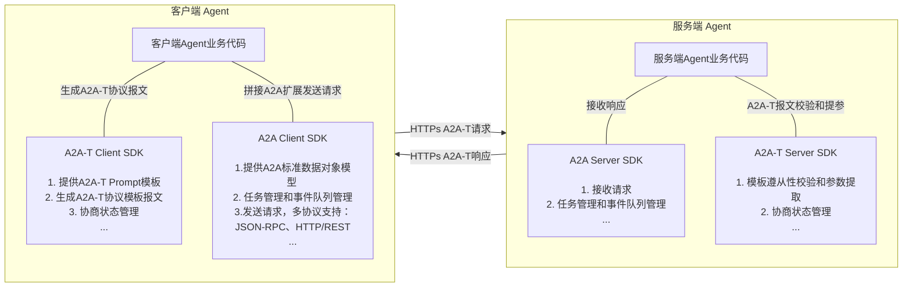
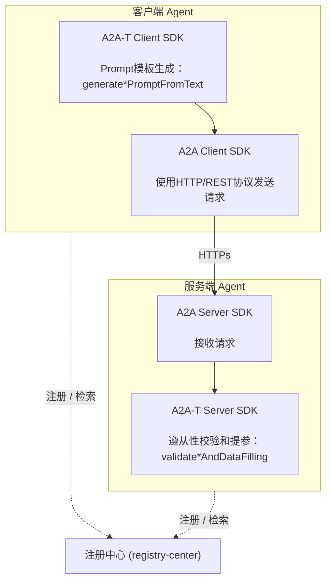
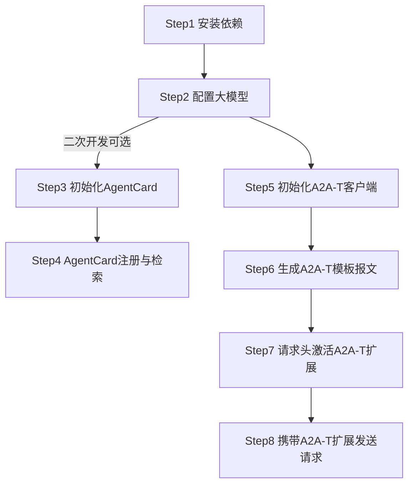
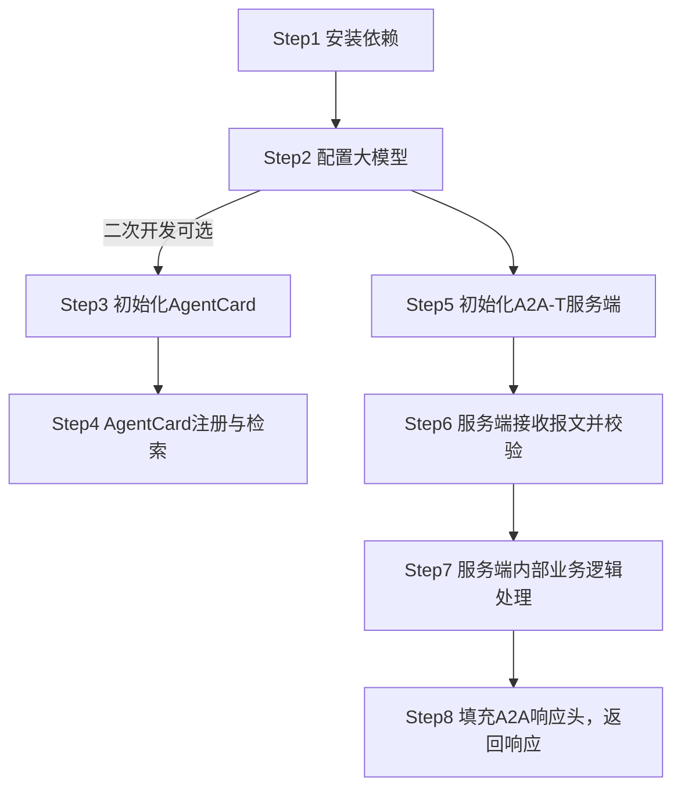

# 1 a2a-t-sdk-java 开发指南

| 分类     | 说明                                                         |
| -------- | ------------------------------------------------------------ |
| 目标读者 | 基于A2A-T SDK进行多智能体协议交互的开发者、集成部署人员、项目对接运维人员 |
| 文档目的 | 本文档详细介绍A2A-T SDK的完整安装方式、参数配置及最小实践。帮助使用者快速、规范地完成SDK接入、功能开发和线上落地。 |
| 阅读前提 | 了解A2A多智能体协议的数据模型定义和使用，了解AgentCard模型定义和使用，了解注册中心相关功能 |

## 1.1 特性介绍

### 1.1.1 A2A-T能力介绍
A2A-T（Agent-to-Agent Telecom）是基于A2A协议推出的电信领域多智能体互联协议，专为电信领域复杂协同场景设计。

电信领域的业务场景复杂、要求高，运维智能体互联和协同需要有专门的协议进行支撑。A2A-T方案基于A2A协议，重点针对电信领域业务流相关的信息模型、任务协商、协作安全等增强能力进行应用扩展。

a2a-t-sdk-java是面向电信智能体协作场景的 Java SDK，用于在 A2A-T 交互中生成、校验和协商任务提示词。SDK 适合客户端 Agent、服务端 Agent 以及上层编排系统集成使用。

主要能力包括：

- **客户端模板报文生成**：客户端根据自然语言或结构化输入生成符合 A2A-T 格式的协议报文。
- **服务端模板报文校验**：服务端校验客户端下发的 A2A-T协议格式报文 是否匹配场景、模板和槽位约束。
- **多轮协商管理**：支持`information`、`feasibility`、`target`协商流程。
- **模板资源管理**：内置场景、槽位、模板和系统提示词资源，支持`classpath`与本地文件两种资源加载方式。
- **LLM 适配**：通过 OpenAI-compatible 调用链接入外部大模型。

SDK提供的API列表和使用说明，详见 [API参考.md](API参考.md)。

### 1.1.2 A2A-T SDK与A2A SDK的关系

A2A-T协议是基于A2A协议的扩展，针对协议扩展的内容提供了A2A-T SDK，支撑快速构建满用于电信领域复杂协同场景的智能体。

A2A-T SDK独立于A2A SDK，通过同时集成A2A-T SDK与A2A SDK可以构建支持A2A-T协议的agent，支持电信领域多agent之间的确定性、高可靠、高效及安全协同。Java生态中可搭配的A2A SDK为a2a-java（`org.a2aproject.sdk`）。



### 1.1.3 A2A-T SDK典型交互场景

一个典型的多智能体协作交互场景至少涉及到三个组件：客户端Agent、服务端Agent、注册中心；

各组件间关系示例如下：




## 1.2 约束与限制

1. JDK 版本要求为 17+，构建工具要求 Maven 3.8+。
2. 完整的多智能体协议交互开发需要同时引入 A2A 官方 Java SDK（a2a-java，`org.a2aproject.sdk`），要求版本不小于 `1.0.0.Beta1` 。
3. 提示词资源支持 `classpath`（默认，从 `a2a-t-resources` jar 内置资源加载）和 `local_file`（本地文件资源）两种来源。
4. 协商状态存储仅提供 `in_memory`，进程退出后状态丢失。
5. A2A-T SDK 不提供 Agent HTTP 服务框架、注册中心客户端、鉴权和密钥管理能力，需由业务系统集成。

## 1.3 环境准备

### 1.3.1 环境要求

| 项目     | 要求                                     |
| -------- | ---------------------------------------- |
| Java     | JDK 17+                                  |
| 构建工具 | Maven 3.8+                               |
| LLM      | 需要可访问的 OpenAI 服务及 API Key       |
| 操作系统 | Linux、Windows、macOS 均可用于开发和联调 |

### 1.3.2 搭建环境

以Windows11 64位 amd64 开发环境为例

**安装JDK 17**

1. 官网下载链接：https://www.oracle.com/java/technologies/downloads/#java17 （也可使用 Adoptium Temurin 等发行版：https://adoptium.net/temurin/releases/?version=17 ）

2. 下载 Windows x64 Installer（`.msi` 或 `.exe`）并以管理员身份执行

3. 安装时勾选或安装后手工配置环境变量：`JAVA_HOME` 指向 JDK 安装目录，并将 `%JAVA_HOME%\bin` 加入 `PATH`

4. 安装完成，打开终端输入校验命令：

   ```shell
   java -version
   # 预期输出：openjdk version "17.0.x" ...
   ```

**安装Maven**

1. 官网下载链接：https://maven.apache.org/download.cgi ，下载 `apache-maven-3.9.x-bin.zip` 并解压到本地目录

2. 配置环境变量：`MAVEN_HOME` 指向解压目录，并将 `%MAVEN_HOME%\bin` 加入 `PATH`

3. 安装完成，输入校验命令：

   ```shell
   mvn -version
   # 预期输出：Apache Maven 3.9.x
   ```

## 1.4 基础开发样例

目的：通过提供A2A-T客户端和服务端的样例代码，帮助使用者快速、规范地熟悉SDK接入流程，加速功能开发和线上落地。

### 1.4.1 样例接口说明

本基础开发样例主要使用到A2A-T SDK如下两个API，实际开发过程中需按业务实际诉求选择不同API使用：

**1、A2A-T Client SDK**

接口定义及功能描述：从自然语言文本按指定 Notification-T 模板生成通知订阅提示词报文（跳过场景识别）。执行一次 LLM 槽位提取后确定性渲染模板，生成阶段执行内置槽位 Schema 校验。

```java
public MetadataContent generateNotificationPromptFromText(String text, TemplateUri templateUri)
```

接口调用样例：

```java
import java.nio.file.Path;
import net.openan.a2at.sdk.client.A2ATClient;
import net.openan.a2at.sdk.core.model.MetadataContent;
import net.openan.a2at.sdk.core.model.TemplateUri;

A2ATClient client = new A2ATClient(Path.of("client.env"));
TemplateUri templateUri = TemplateUri.parse("Notification-T/network-layer/service-recovery/v1").orElseThrow();

MetadataContent result = client.generateNotificationPromptFromText(
        "我想订阅一下业务抢通事件。上报通知数据格式如下："
                + "1. 业务抢通方案执行状态，取值范围：未启动、已结束；"
                + "2. 投诉诊断任务流水号；3. OSS侧事件流水号；4. 接入端口名称；"
                + "5. 是否已授权OMC自动抢通，取值范围：是、否；6. 业务抢通方案名称；7. 业务抢通方案详情",
        templateUri);

/*输出生成的通知订阅提示词报文（result.promptText()，实际文本随 LLM 槽位提取结果变化）
## 订阅描述
请根据以下 <通知主题>、<订阅条件>、<上报通知数据格式> 及 <预期输出> 信息，完成网络侧业务抢通事件的订阅与上报任务。

## 通知主题
业务抢通事件

## 订阅条件
（可选）
1. 子网名称；举例：xx子网；

## 上报通知数据格式
1. 业务抢通方案执行状态，取值范围：未启动、已结束
2. 投诉诊断任务流水号
3. OSS侧事件流水号
4. 接入端口名称
5. 是否已授权OMC自动抢通，取值范围：是、否
6. 业务抢通方案名称
7. 业务抢通方案详情

## 预期输出
1. 订阅结果，取值范围：成功、失败
2. 订阅失败原因（可选）
3. 订阅成功后，按照<上报通知数据格式>上报消息
*/
```

**2、A2A-T Server SDK**

接口定义及功能描述：校验一条 Notification-T 通知订阅提示词报文是否匹配模板与槽位约束，并按调用方 Schema 提取参数（订阅主题、订阅条件、上报通知数据格式等）。

```java
public FilledParamData validateNotificationPromptAndDataFilling(
        String prompt, Map<String, Object> schema, TemplateUri templateUri)
```

接口调用样例：校验客户端发来的通知订阅报文并提取订阅参数

```java
import java.nio.file.Path;
import java.util.List;
import java.util.Map;
import net.openan.a2at.sdk.core.model.FilledParamData;
import net.openan.a2at.sdk.core.model.TemplateUri;
import net.openan.a2at.sdk.server.A2ATServer;

A2ATServer server = new A2ATServer(Path.of("server.env"));
TemplateUri templateUri = TemplateUri.parse("Notification-T/network-layer/service-recovery/v1").orElseThrow();

Map<String, Object> validationSchema = Map.of(
        "type", "object",
        "properties", Map.of(
                "topic", Map.of("type", "string", "description", "订阅主题（必选）。订阅的事件主题名称。"),
                "subscriptionCondition", Map.of(
                        "type", "string", "description", "订阅条件（可选）。待订阅的条件描述。"),
                "notificationDataFormat", Map.of(
                        "type", "string", "description", "上报通知数据格式（必选）。待上报的通知数据格式描述。")),
        "required", List.of("topic", "notificationDataFormat"));

// promptText 为客户端生成的通知订阅提示词报文文本（见上文客户端调用样例）
FilledParamData result = server.validateNotificationPromptAndDataFilling(
        promptText, validationSchema, templateUri);

/*按 Schema 提取的订阅参数（result.data()，订阅条件为空表示本例输入未携带订阅条件）
{
  topic=业务抢通事件,
  subscriptionCondition=,
  notificationDataFormat=业务抢通事件数据包含：业务抢通方案执行状态（未启动、已结束）、投诉诊断任务流水号、OSS侧事件流水号、接入端口名称、是否已授权OMC自动抢通（是、否）、业务抢通方案名称、业务抢通方案详情。
}
*/
```

### 1.4.2 开发流程

- 客户端开发流程



> 二次开发指已基于A2A开发Agent，并对接过注册中心

- 服务端开发流程：




### 1.4.3 样例客户端开发步骤

#### Step1 安装依赖

业务项目可使用 BOM 统一管理 A2A-T SDK 版本：

```xml
<dependencyManagement>
    <dependencies>
        <dependency>
            <groupId>net.openan.a2a-t.sdk</groupId>
            <artifactId>a2a-t-bom</artifactId>
            <version>1.0.0</version>
            <type>pom</type>
            <scope>import</scope>
        </dependency>
    </dependencies>
</dependencyManagement>
```

客户端 Agent 引用：

```xml
<!-- A2A-T SDK -->
<dependency>
    <groupId>net.openan.a2a-t.sdk</groupId>
    <artifactId>a2a-t-client</artifactId>
</dependency>

<!-- A2A 官方 Java SDK -->
<dependency>
    <groupId>org.a2aproject.sdk</groupId>
    <artifactId>a2a-java-sdk-client</artifactId>
    <version>1.0.0.Beta1</version>
</dependency>
<dependency>
    <groupId>org.a2aproject.sdk</groupId>
    <artifactId>a2a-java-sdk-client-transport-rest</artifactId>
    <version>1.0.0.Beta1</version>
</dependency>
```

> 本指南样例中，A2A 请求统一通过 A2A 官方 Java SDK（a2a-java 的 `Client` + REST 传输）发送；
>
> 仅注册中心的注册与检索使用 JDK 内置 `HttpClient` 与 Jackson（注册中心不属于 a2a-java 能力范围，业务系统可替换为 OkHttp、Spring RestTemplate 等任意 HTTP 客户端和 JSON 库）。如需在客户端使用 Jackson，可添加：
>
> ```xml
> <dependency>
>  <groupId>com.fasterxml.jackson.core</groupId>
>  <artifactId>jackson-databind</artifactId>
>  <version>2.20.1</version>
> </dependency>
> ```

#### Step2 配置大模型

复制仓库根目录`env.example`文件内容到`client.env`中（服务端对应`server.env`），配置如下内容

```properties
# Controls the language used by prompt runtime components.
A2AT_LANGUAGE=zh-CN

# Selects the prompt source backend (classpath | local_file).
A2AT_PROMPT_SOURCE_TYPE=classpath

# Required when A2AT_PROMPT_SOURCE_TYPE=local_file
A2AT_PROMPT_RESOURCE_LOCAL_ROOT_DIR=

# Selects the LLM provider used by the shared client.
A2AT_LLM_PROVIDER=openai

# Selects the default model name for the configured provider.
A2AT_LLM_MODEL=deepseek-chat

# API key for the configured LLM provider.
A2AT_LLM_API_KEY={your_llm_api_key}

# Base URL for the configured LLM provider.
A2AT_LLM_BASE_URL=https://api.deepseek.com

# Selects the negotiation state store implementation.
A2AT_NEGOTIATION_STATE_STORE_TYPE=in_memory

# Input limits
A2AT_INPUT_TEXT_MAX_CHARS=16384
```

> `A2AT_LLM_API_KEY` 是**调用外部大模型**使用的密钥，请妥善保存
>
> SDK 通过 OpenAI-compatible 接入外部大模型，`A2AT_LLM_PROVIDER` 当前仅支持 `openai`；接入 DeepSeek 等 OpenAI 兼容服务时，通过 `A2AT_LLM_BASE_URL` 指定服务地址、`A2AT_LLM_MODEL` 指定模型名。
>

#### Step3 初始化AgentCard

a2a-java 官方推荐使用 Builder 构造 `AgentCard`（`org.a2aproject.sdk.spec.AgentCard`），可在 `capabilities.extensions` 中声明支持的 A2A-T 模板；注册到注册中心时，AgentCard 序列化为 JSON（外层包装为 `{"agentCards": [...]}`）。

- 客户端样例AgentCard定义参考（可在`extensions`中声明支持的A2A-T模板）：

```java
import java.util.List;
import org.a2aproject.sdk.spec.AgentCapabilities;
import org.a2aproject.sdk.spec.AgentCard;
import org.a2aproject.sdk.spec.AgentExtension;
import org.a2aproject.sdk.spec.AgentInterface;
import org.a2aproject.sdk.spec.AgentProvider;
import org.a2aproject.sdk.spec.AgentSkill;

private static final String TASK_T_EXT_URI =
        "https://projects.tmforum.org/a2aproject/telecommunication/extensions/Task-T/v1";
private static final String NOTIFICATION_T_EXT_URI =
        "https://projects.tmforum.org/a2aproject/telecommunication/extensions/Notification-T/v1";

private static AgentCard buildClientAgentCard() {
    return AgentCard.builder()
            .name("Transmission workbench agent")
            .description("传输网络运维管理智能体，提供电路恢复验证、基站退服根因分析、网元隐患排查等运维能力")
            .provider(new AgentProvider("ZzNode", "https://example.com"))
            .version("1.0.0")
            .capabilities(AgentCapabilities.builder()
                    .streaming(true)
                    .pushNotifications(false)
                    .extendedAgentCard(false)
                    .extensions(List.of(
                            AgentExtension.builder()
                                    .uri(TASK_T_EXT_URI)
                                    .description("Extension of structured prompt Task-T requests.")
                                    .build(),
                            AgentExtension.builder()
                                    .uri(NOTIFICATION_T_EXT_URI)
                                    .description("Extension of structured prompt Notification-T requests.")
                                    .build()))
                    .build())
            .defaultInputModes(List.of("application/json", "text/plain"))
            .defaultOutputModes(List.of("application/json", "text/plain"))
            .skills(List.of(
                    AgentSkill.builder()
                            .id("circuit-recovery-verification")
                            .name("电路恢复验证智能体")
                            .description("电路业务恢复验证技能。根据请求中的电路名称，代入固定JSON模板返回业务恢复验证结果。当用户提到“业务恢复验证”、“电路恢复验证”、“circuit recovery verification”或类似请求时使用。适用于需要对指定电路进行业务恢复状态确认的场景。")
                            .tags(List.of("电路恢复验证", "业务恢复验证", "circuit-recovery"))
                            .examples(List.of(
                                    "请对电路：LYSPELC3、SN3二期-LYXLSJLT1号楼10GE1049641NR进行业务恢复验证",
                                    "对电路XXX进行业务恢复验证",
                                    "circuit recovery verification for circuit XXX"))
                            .inputModes(List.of("application/json", "text/plain"))
                            .outputModes(List.of("application/json", "text/plain"))
                            .build(),
                    AgentSkill.builder()
                            .id("ne-hidden-danger")
                            .name("网元隐患排查智能体")
                            .description("网元隐患排查技能。根据输入的网元名称，排查该网元是否还存在新的隐患。当用户提到“隐患排查”、“检查隐患”、“网元排查”、“ne hidden danger”或类似请求时使用。适用于需要对指定网元进行隐患状态检查的场景。")
                            .tags(List.of("网元排查", "隐患排查", "NE-inspection"))
                            .examples(List.of(
                                    "请排查QZHA-HAZBYSDGG-HRHH网元是否还产生新隐患",
                                    "排查网元XXX是否还存在隐患",
                                    "Check if NE XXX has any hidden dangers"))
                            .inputModes(List.of("application/json", "text/plain"))
                            .outputModes(List.of("application/json", "text/plain"))
                            .build()))
            .supportedInterfaces(List.of(
                    new AgentInterface("HTTP+JSON", "http://10.xx.xx.xx:26335/a2a/v1", "", "1.0")))
            .build();
}
```

- 客户端样例AgentCard Json报文参考：

```json
{
  "agentCards": [
    {
      "name": "Transmission workbench agent",
      "description": "传输网络运维管理智能体，提供电路恢复验证、基站退服根因分析、网元隐患排查等运维能力",
      "supportedInterfaces": [
        {
          "url": "http://10.xx.xx.xx:26335/a2a/v1",
          "protocolBinding": "HTTP+JSON",
          "protocolVersion": "1.0"
        }
      ],
      "provider": {
        "organization": "ZzNode"
      },
      "version": "1.0.0",
      "capabilities": {
        "streaming": true,
        "pushNotifications": false,
        "extensions": [
          {
            "uri": "https://projects.tmforum.org/a2aproject/telecommunication/extensions/Task-T/v1",
            "description": "Extension of structured prompt Task-T requests."
          },
          {
            "uri": "https://projects.tmforum.org/a2aproject/telecommunication/extensions/Notification-T/v1",
            "description": "Extension of structured prompt Notification-T requests."
          }
        ],
        "extendedAgentCard": false
      },
      "securitySchemes": {
        "bearerAuth": {
          "httpAuthSecurityScheme": {
            "description": "使用用户名和密码通过登录接口查询accessSession后，使用该accessSession进行bearer认证。",
            "scheme": "Bearer"
          }
        }
      },
      "defaultInputModes": [
        "application/json",
        "text/plain"
      ],
      "defaultOutputModes": [
        "application/json",
        "text/plain"
      ],
      "skills": [
        {
          "id": "circuit-recovery-verification",
          "name": "电路恢复验证智能体",
          "description": "电路业务恢复验证技能。根据请求中的电路名称，代入固定JSON模板返回业务恢复验证结果。当用户提到“业务恢复验证”、“电路恢复验证”、“circuit recovery verification”或类似请求时使用。适用于需要对指定电路进行业务恢复状态确认的场景。",
          "tags": [
            "电路恢复验证",
            "业务恢复验证",
            "circuit-recovery"
          ],
          "examples": [
            "请对电路：LYSPELC3、SN3二期-LYXLSJLT1号楼10GE1049641NR进行业务恢复验证",
            "对电路XXX进行业务恢复验证",
            "circuit recovery verification for circuit XXX"
          ],
          "inputModes": [
            "application/json",
            "text/plain"
          ],
          "outputModes": [
            "application/json",
            "text/plain"
          ]
        },
        {
          "id": "ne-hidden-danger",
          "name": "网元隐患排查智能体",
          "description": "网元隐患排查技能。根据输入的网元名称，排查该网元是否还存在新的隐患。当用户提到“隐患排查”、“检查隐患”、“网元排查”、“ne hidden danger”或类似请求时使用。适用于需要对指定网元进行隐患状态检查的场景。",
          "tags": [
            "网元排查",
            "隐患排查",
            "NE-inspection"
          ],
          "examples": [
            "请排查QZHA-HAZBYSDGG-HRHH网元是否还产生新隐患",
            "排查网元XXX是否还存在隐患",
            "Check if NE XXX has any hidden dangers"
          ],
          "inputModes": [
            "application/json",
            "text/plain"
          ],
          "outputModes": [
            "application/json",
            "text/plain"
          ]
        }
      ]
    }
  ]
}
```

#### Step4 AgentCard注册与检索

- **AgentCard注册**：将客户端AgentCard发布到注册中心，注册中心的地址和URI以实际部署情况为准

```java
import java.net.URI;
import java.net.http.HttpClient;
import java.net.http.HttpRequest;
import java.net.http.HttpResponse;
import java.util.List;
import java.util.Map;
import com.fasterxml.jackson.annotation.JsonInclude;
import com.fasterxml.jackson.databind.ObjectMapper;
import org.a2aproject.sdk.spec.AgentCard;

private static final HttpClient HTTP_CLIENT = HttpClient.newHttpClient();
private static final ObjectMapper MAPPER = new ObjectMapper().setSerializationInclusion(JsonInclude.Include.NON_NULL);

private static void registerAgentCard(String registryBaseUrl, AgentCard agentCard)
        throws Exception {
    String payload = MAPPER.writeValueAsString(Map.of("agentCards", List.of(agentCard)));
    HttpRequest request = HttpRequest.newBuilder()
            .uri(URI.create(registryBaseUrl + "/rest/v1/registry-center/agent-cards"))
            .header("Content-Type", "application/json")
            .POST(HttpRequest.BodyPublishers.ofString(payload))
            .build();
    HttpResponse<String> response = HTTP_CLIENT.send(request, HttpResponse.BodyHandlers.ofString());
    if (response.statusCode() != 201) {
        throw new IllegalStateException("AgentCard registration failed: " + response.statusCode());
    }
}
```

- **AgentCard检索**：根据目标Agent名称或技能，从注册中心查询并获取其 AgentCard，从而得到 `url` 和支持的技能

```java
import java.util.List;
import java.util.Map;
import com.fasterxml.jackson.core.type.TypeReference;

private static Map<String, Object> discoverAgent(
        String registryBaseUrl, String organization, String name) throws Exception {
    HttpRequest request = HttpRequest.newBuilder()
            .uri(URI.create(registryBaseUrl + "/rest/v1/registry-center/agent-cards/"
                    + organization + "/" + name))
            .GET()
            .build();
    HttpResponse<String> response = HTTP_CLIENT.send(request, HttpResponse.BodyHandlers.ofString());
    if (response.statusCode() >= 400) {
        throw new IllegalStateException("AgentCard query failed: " + response.statusCode());
    }
    Map<String, Object> payload =
            MAPPER.readValue(response.body(), new TypeReference<Map<String, Object>>() {});
    return (Map<String, Object>) ((List<?>) payload.get("agentCards")).get(0);
}
```

检索结果为注册中心返回的 JSON 结构。由于 a2a-java 的 `Client.builder(...)` 接收 `org.a2aproject.sdk.spec.AgentCard` 对象，需将其转换为官方 AgentCard 模型：

```java
import java.util.List;
import java.util.Map;
import org.a2aproject.sdk.spec.AgentCapabilities;
import org.a2aproject.sdk.spec.AgentCard;
import org.a2aproject.sdk.spec.AgentExtension;
import org.a2aproject.sdk.spec.AgentInterface;
import org.a2aproject.sdk.spec.AgentProvider;
import org.a2aproject.sdk.spec.AgentSkill;

@SuppressWarnings("unchecked")
private static AgentCard toAgentCard(Map<String, Object> registryAgentCard) {
    Map<String, Object> provider = (Map<String, Object>) registryAgentCard.getOrDefault("provider", Map.of());
    Map<String, Object> capabilities = (Map<String, Object>) registryAgentCard.getOrDefault("capabilities", Map.of());
    List<Map<String, Object>> extensionMaps =
            (List<Map<String, Object>>) capabilities.getOrDefault("extensions", List.of());
    List<Map<String, Object>> skillMaps =
            (List<Map<String, Object>>) registryAgentCard.getOrDefault("skills", List.of());
    List<Map<String, Object>> interfaceMaps =
            (List<Map<String, Object>>) registryAgentCard.getOrDefault("supportedInterfaces", List.of());

    return AgentCard.builder()
            .name(string(registryAgentCard.get("name")))
            .description(string(registryAgentCard.get("description")))
            .provider(new AgentProvider(string(provider.get("organization")), string(provider.get("url"))))
            .version(string(registryAgentCard.get("version")))
            .capabilities(AgentCapabilities.builder()
                    .streaming(Boolean.TRUE.equals(capabilities.get("streaming")))
                    .pushNotifications(Boolean.TRUE.equals(capabilities.get("pushNotifications")))
                    .extendedAgentCard(Boolean.TRUE.equals(capabilities.get("extendedAgentCard")))
                    .extensions(extensionMaps.stream()
                            .map(extension -> AgentExtension.builder()
                                    .uri(string(extension.get("uri")))
                                    .description(string(extension.get("description")))
                                    .required(Boolean.TRUE.equals(extension.get("required")))
                                    .build())
                            .toList())
                    .build())
            .defaultInputModes(stringList(registryAgentCard.get("defaultInputModes")))
            .defaultOutputModes(stringList(registryAgentCard.get("defaultOutputModes")))
            .skills(skillMaps.stream()
                    .map(skill -> AgentSkill.builder()
                            .id(string(skill.get("id")))
                            .name(string(skill.get("name")))
                            .description(string(skill.get("description")))
                            .tags(stringList(skill.get("tags")))
                            .build())
                    .toList())
            .supportedInterfaces(interfaceMaps.stream()
                    .map(agentInterface -> new AgentInterface(
                            string(agentInterface.get("protocolBinding")),
                            string(agentInterface.get("url")),
                            string(agentInterface.getOrDefault("tenant", "")),
                            string(agentInterface.getOrDefault("protocolVersion", "1.0"))))
                    .toList())
            .build();
}

private static String string(Object value) {
    return value == null ? "" : String.valueOf(value);
}

private static List<String> stringList(Object value) {
    return value instanceof List<?> values ? values.stream().map(String::valueOf).toList() : List.of();
}
```

#### Step5 初始化A2A-T客户端

```java
import java.nio.file.Path;
import net.openan.a2at.sdk.client.A2ATClient;

A2ATClient client = new A2ATClient(Path.of("client.env"));
```

`A2ATClient` 与 `A2ATServer` 均在构造时显式传入 `.env` 文件路径（Java SDK 不自动发现配置文件），路径相对于进程工作目录解析，建议使用绝对路径。

#### Step6 生成A2A-T模板报文

客户端使用A2A-T Client SDK API `generateNotificationPromptFromText`生成 Notification-T 订阅报文（processed_prompt），再将其作为 A2A 消息的一部分发送给目标 agent。

```java
import java.nio.file.Path;
import net.openan.a2at.sdk.client.A2ATClient;
import net.openan.a2at.sdk.core.model.MetadataContent;
import net.openan.a2at.sdk.core.model.TemplateUri;

A2ATClient client = new A2ATClient(Path.of("client.env"));

// 生成 A2A-T 通知订阅提示词报文（生成失败时抛出PromptGenerationException，携带code、message）
TemplateUri templateUri =
        TemplateUri.parse("Notification-T/network-layer/service-recovery/v1").orElseThrow();
MetadataContent result = client.generateNotificationPromptFromText(
        "我想订阅一下业务抢通事件。上报通知数据格式如下："
                + "1. 业务抢通方案执行状态，取值范围：未启动、已结束；"
                + "2. 投诉诊断任务流水号；3. OSS侧事件流水号；4. 接入端口名称；"
                + "5. 是否已授权OMC自动抢通，取值范围：是、否；6. 业务抢通方案名称；7. 业务抢通方案详情",
        templateUri);

String processedPrompt = result.promptText();
String extensionUri = result.extensionUri();  // A2A-T扩展URI，用于消息metadata与请求头
```

#### Step7 请求头激活A2A-T扩展

A2A 协议通过 HTTP Header 传递协议版本与扩展声明，需使用如下Header

| Header           | 方向   | 必填            | 取值                                              |
| ---------------- | ------ | --------------- | ------------------------------------------------- |
| `A2A-Version`    | 请求头 | 是              | 协议版本，如 `1.0`（客户端必须随每个请求携带）    |
| `A2A-Extensions` | 请求头 | 使用A2A-T时必填 | 逗号分隔的扩展 URI 列表，声明本次请求要使用的扩展 |

客户端请求头填写样例：使用 a2a-java 发送请求时，`A2A-Extensions` 通过 `ClientCallContext` 的 headers 传入（协议版本等协议头由 a2a-java 传输层按协议要求携带）

```java
import java.util.Map;
import org.a2aproject.sdk.client.transport.spi.interceptors.ClientCallContext;

String notificationPromptExt = "https://projects.tmforum.org/a2aproject/telecommunication/extensions/Notification-T/v1";

ClientCallContext callContext =
        new ClientCallContext(Map.of(), Map.of("A2A-Extensions", notificationPromptExt));
```

#### Step8 携带A2A-T扩展发送请求

使用 a2a-java 官方 SDK 发送请求：processed prompt 放入 `Message.metadata`（以扩展 URI 为 key），请求头通过 `ClientCallContext` 声明，由 `Client` 经 REST 传输发送。

```java
import java.nio.file.Path;
import java.util.List;
import java.util.Map;
import java.util.UUID;
import java.util.concurrent.CountDownLatch;
import net.openan.a2at.sdk.client.A2ATClient;
import net.openan.a2at.sdk.core.model.MetadataContent;
import net.openan.a2at.sdk.core.model.TemplateUri;
import org.a2aproject.sdk.client.Client;
import org.a2aproject.sdk.client.ClientEvent;
import org.a2aproject.sdk.client.MessageEvent;
import org.a2aproject.sdk.client.TaskUpdateEvent;
import org.a2aproject.sdk.client.transport.rest.RestTransport;
import org.a2aproject.sdk.client.transport.rest.RestTransportConfig;
import org.a2aproject.sdk.client.transport.spi.interceptors.ClientCallContext;
import org.a2aproject.sdk.spec.AgentCard;
import org.a2aproject.sdk.spec.Message;
import org.a2aproject.sdk.spec.MessageSendParams;
import org.a2aproject.sdk.spec.TaskArtifactUpdateEvent;
import org.a2aproject.sdk.spec.TaskStatusUpdateEvent;
import org.a2aproject.sdk.spec.TextPart;

String notificationPromptExt = "https://projects.tmforum.org/a2aproject/telecommunication/extensions/Notification-T/v1";

        // 1) 生成 A2A-T 模板报文（见 1.4.3 Step6）
A2ATClient client = new A2ATClient(Path.of("client.env"));
TemplateUri templateUri =
        TemplateUri.parse("Notification-T/network-layer/service-recovery/v1").orElseThrow();
MetadataContent result = client.generateNotificationPromptFromText(
        "我想订阅一下业务抢通事件。上报通知数据格式如下："
                + "1. 业务抢通方案执行状态，取值范围：未启动、已结束；"
                + "2. 投诉诊断任务流水号；3. OSS侧事件流水号；4. 接入端口名称；"
                + "5. 是否已授权OMC自动抢通，取值范围：是、否；6. 业务抢通方案名称；7. 业务抢通方案详情",
        templateUri);
String processedPrompt = result.promptText();

// 2) 构造携带A2A-T扩展的A2A消息（prompt放入metadata，以扩展URI为key）
Message message = Message.builder()
        .messageId(UUID.randomUUID().toString())
        .role(Message.Role.ROLE_USER)
        .parts(new TextPart("我想订阅一下业务抢通事件"))
        .metadata(Map.of(notificationPromptExt, processedPrompt))
        .build();
MessageSendParams params = MessageSendParams.builder().message(message).build();

        // 3) 通过 ClientCallContext 声明A2A-T扩展请求头（见 1.4.3 Step7）
ClientCallContext callContext =
        new ClientCallContext(Map.of(), Map.of("A2A-Extensions", notificationPromptExt));

// 4) 使用 a2a-java Client 发送请求并消费任务事件
CountDownLatch done = new CountDownLatch(1);
        try (Client a2aClient = Client.builder(agentCard)
        .withTransport(RestTransport.class, new RestTransportConfig())
        .build()) {
    a2aClient.sendMessage(
            params,
            List.of((event, ignored) -> handleEvent(event, done)),
            throwable -> {
                throwable.printStackTrace();
                done.countDown();
            },
            callContext);
    // AgentCard声明streaming=true时走message:stream流式，sendMessage立即返回，等待任务进入终态；
    // 否则走message:send阻塞模式，sendMessage返回时任务已结束
    done.await();
}

private static void handleEvent(ClientEvent event, CountDownLatch done) {
    if (event instanceof TaskUpdateEvent update) {
        if (update.getUpdateEvent() instanceof TaskStatusUpdateEvent statusUpdate) {
            System.out.println("task-status: " + statusUpdate.status().state());
            if (statusUpdate.status().state().isFinal()) {
                done.countDown();
            }
        } else if (update.getUpdateEvent() instanceof TaskArtifactUpdateEvent artifactUpdate) {
            System.out.println("task-artifact: " + artifactUpdate.artifact().parts());
        }
    } else if (event instanceof MessageEvent messageEvent) {
        System.out.println("task-message: " + messageEvent.getMessage().parts());
    }
}
```

#### 样例客户端完整代码

```java
import java.net.URI;
import java.net.http.HttpClient;
import java.net.http.HttpRequest;
import java.net.http.HttpResponse;
import java.nio.file.Path;
import java.util.List;
import java.util.Map;
import java.util.UUID;
import java.util.concurrent.CountDownLatch;
import com.fasterxml.jackson.annotation.JsonInclude;
import com.fasterxml.jackson.core.type.TypeReference;
import com.fasterxml.jackson.databind.ObjectMapper;
import net.openan.a2at.sdk.client.A2ATClient;
import net.openan.a2at.sdk.core.model.MetadataContent;
import net.openan.a2at.sdk.core.model.TemplateUri;
import org.a2aproject.sdk.client.Client;
import org.a2aproject.sdk.client.ClientEvent;
import org.a2aproject.sdk.client.MessageEvent;
import org.a2aproject.sdk.client.TaskUpdateEvent;
import org.a2aproject.sdk.client.transport.rest.RestTransport;
import org.a2aproject.sdk.client.transport.rest.RestTransportConfig;
import org.a2aproject.sdk.client.transport.spi.interceptors.ClientCallContext;
import org.a2aproject.sdk.spec.AgentCard;
import org.a2aproject.sdk.spec.Message;
import org.a2aproject.sdk.spec.MessageSendParams;
import org.a2aproject.sdk.spec.TaskArtifactUpdateEvent;
import org.a2aproject.sdk.spec.TaskStatusUpdateEvent;
import org.a2aproject.sdk.spec.TextPart;

public final class ClientSample {
    private static final String NOTIFICATION_T_EXT_URI =
            "https://projects.tmforum.org/a2aproject/telecommunication/extensions/Notification-T/v1";

    private static final ObjectMapper MAPPER = new ObjectMapper().setSerializationInclusion(JsonInclude.Include.NON_NULL);
    private static final HttpClient HTTP_CLIENT = HttpClient.newHttpClient();

    public static void main(String[] args) throws Exception {
        // 1) 注册客户端AgentCard，检索服务端AgentCard
        registerAgentCard("http://{ip:port}", buildClientAgentCard());  // 1.4.3 Step3 定义的客户端AgentCard
        AgentCard serverAgentCard = toAgentCard(
                discoverAgent("http://{ip:port}", "Huawei", "RAN Domain Agent"));

        // 2) 使用SDK能力生成 A2A-T 通知订阅提示词报文
        A2ATClient client = new A2ATClient(Path.of("client.env"));
        TemplateUri templateUri =
                TemplateUri.parse("Notification-T/network-layer/service-recovery/v1").orElseThrow();
        MetadataContent result = client.generateNotificationPromptFromText(
                "我想订阅一下业务抢通事件。上报通知数据格式如下："
                        + "1. 业务抢通方案执行状态，取值范围：未启动、已结束；"
                        + "2. 投诉诊断任务流水号；3. OSS侧事件流水号；4. 接入端口名称；"
                        + "5. 是否已授权OMC自动抢通，取值范围：是、否；6. 业务抢通方案名称；7. 业务抢通方案详情",
                templateUri);
        String processedPrompt = result.promptText();

        // 3) 构造携带A2A-T扩展的A2A消息（请求头声明扩展，消息体携带 A2A-T 扩展字段）
        Message message = Message.builder()
                .messageId(UUID.randomUUID().toString())
                .role(Message.Role.ROLE_USER)
                .parts(new TextPart("我想订阅一下业务抢通事件"))
                .metadata(Map.of(NOTIFICATION_T_EXT_URI, processedPrompt))
                .build();
        MessageSendParams params = MessageSendParams.builder().message(message).build();
        ClientCallContext callContext =
                new ClientCallContext(Map.of(), Map.of("A2A-Extensions", NOTIFICATION_T_EXT_URI));

        // 4) 通过 a2a-java Client 发送请求并消费任务事件
        CountDownLatch done = new CountDownLatch(1);
        try (Client a2aClient = Client.builder(serverAgentCard)
                .withTransport(RestTransport.class, new RestTransportConfig())
                .build()) {
            a2aClient.sendMessage(
                    params,
                    List.of((event, ignored) -> handleEvent(event, done)),
                    throwable -> {
                        throwable.printStackTrace();
                        done.countDown();
                    },
                    callContext);
            done.await();  // 流式模式下等待任务进入终态
        }
    }

    private static void handleEvent(ClientEvent event, CountDownLatch done) {
        if (event instanceof TaskUpdateEvent update) {
            if (update.getUpdateEvent() instanceof TaskStatusUpdateEvent statusUpdate) {
                System.out.println("task-status: " + statusUpdate.status().state());
                if (statusUpdate.status().state().isFinal()) {
                    done.countDown();
                }
            } else if (update.getUpdateEvent() instanceof TaskArtifactUpdateEvent artifactUpdate) {
                System.out.println("task-artifact: " + artifactUpdate.artifact().parts());
            }
        } else if (event instanceof MessageEvent messageEvent) {
            System.out.println("task-message: " + messageEvent.getMessage().parts());
        }
    }

    private static void registerAgentCard(String registryBaseUrl, AgentCard agentCard)
            throws Exception {
        String payload = MAPPER.writeValueAsString(Map.of("agentCards", List.of(agentCard)));
        HttpRequest request = HttpRequest.newBuilder()
                .uri(URI.create(registryBaseUrl + "/rest/v1/registry-center/agent-cards"))
                .header("Content-Type", "application/json")
                .POST(HttpRequest.BodyPublishers.ofString(payload))
                .build();
        HttpResponse<String> response = HTTP_CLIENT.send(request, HttpResponse.BodyHandlers.ofString());
        if (response.statusCode() != 201) {
            throw new IllegalStateException("AgentCard registration failed: " + response.statusCode());
        }
    }

    private static Map<String, Object> discoverAgent(
            String registryBaseUrl, String organization, String name) throws Exception {
        HttpRequest request = HttpRequest.newBuilder()
                .uri(URI.create(registryBaseUrl + "/rest/v1/registry-center/agent-cards/"
                        + organization + "/" + name))
                .GET()
                .build();
        HttpResponse<String> response = HTTP_CLIENT.send(request, HttpResponse.BodyHandlers.ofString());
        if (response.statusCode() >= 400) {
            throw new IllegalStateException("AgentCard query failed: " + response.statusCode());
        }
        Map<String, Object> payload =
                MAPPER.readValue(response.body(), new TypeReference<Map<String, Object>>() {});
        return (Map<String, Object>) ((List<?>) payload.get("agentCards")).get(0);
    }
}
```

> `buildClientAgentCard()`、`toAgentCard(Map)` 及 `string`/`stringList` 辅助方法见 1.4.3 Step3 与 Step4。

### 1.4.4 样例服务端开发步骤

#### Step1-Step5 前置步骤

安装依赖、配置大模型等步骤均可以参考[客户端实现](#143-样例客户端开发步骤)，差异化的内容如下：

服务端 Agent 推荐使用 a2a-java 官方的 REST 参考服务（基于 Quarkus，自动装配 REST 传输、任务管理与事件队列）承载 A2A 请求，引用如下依赖：

```xml
<!-- A2A-T SDK -->
<dependency>
    <groupId>net.openan.a2a-t.sdk</groupId>
    <artifactId>a2a-t-server</artifactId>
</dependency>

<!-- A2A 官方 Java SDK：REST 参考服务（基于 Quarkus） -->
<dependency>
    <groupId>org.a2aproject.sdk</groupId>
    <artifactId>a2a-java-sdk-reference-rest</artifactId>
    <version>1.0.0.Beta1</version>
</dependency>

<!-- 注册中心交互使用的JSON序列化（可替换为任意JSON库） -->
<dependency>
    <groupId>com.fasterxml.jackson.core</groupId>
    <artifactId>jackson-databind</artifactId>
    <version>2.20.1</version>
</dependency>
```

Quarkus 工程还需引入 Quarkus 平台 BOM 与构建插件（完整工程脚手架可参考 a2a-java 官方 [Server Guide](https://a2aproject.github.io/a2a-java/) 或 https://code.quarkus.io 生成）：

```xml
<properties>
    <quarkus.platform.version>3.30.6</quarkus.platform.version>
</properties>

<dependencyManagement>
    <dependencies>
        <!-- A2A-T SDK BOM（见 1.4.3 Step1） -->
        <dependency>
            <groupId>io.quarkus.platform</groupId>
            <artifactId>quarkus-bom</artifactId>
            <version>${quarkus.platform.version}</version>
            <type>pom</type>
            <scope>import</scope>
        </dependency>
    </dependencies>
</dependencyManagement>

<build>
    <plugins>
        <plugin>
            <groupId>io.quarkus.platform</groupId>
            <artifactId>quarkus-maven-plugin</artifactId>
            <version>${quarkus.platform.version}</version>
            <extensions>true</extensions>
            <executions>
                <execution>
                    <goals>
                        <goal>build</goal>
                        <goal>generate-code</goal>
                        <goal>generate-code-tests</goal>
                    </goals>
                </execution>
            </executions>
        </plugin>
    </plugins>
</build>
```

- 初始化A2A-T服务端

```java
import java.nio.file.Path;
import net.openan.a2at.sdk.server.A2ATServer;

A2ATServer server = new A2ATServer(Path.of("server.env"));
```

- 初始化AgentCard：a2a-java 官方推荐通过 CDI Producer 暴露 `@PublicAgentCard` 限定的 AgentCard（使用 Builder 构造，构造方式参考 1.4.3 Step3），服务端样例AgentCard定义参考：

```java
import java.util.List;
import org.a2aproject.sdk.spec.AgentCapabilities;
import org.a2aproject.sdk.spec.AgentCard;
import org.a2aproject.sdk.spec.AgentExtension;
import org.a2aproject.sdk.spec.AgentInterface;
import org.a2aproject.sdk.spec.AgentProvider;
import org.a2aproject.sdk.spec.AgentSkill;

private static final String TASK_T_EXT_URI =
        "https://projects.tmforum.org/a2aproject/telecommunication/extensions/Task-T/v1";
private static final String NOTIFICATION_T_EXT_URI =
        "https://projects.tmforum.org/a2aproject/telecommunication/extensions/Notification-T/v1";

private static AgentCard buildServerAgentCard() {
    return AgentCard.builder()
            .name("RAN Domain Agent")
            .description("RAN Domain Agent")
            .provider(new AgentProvider("Huawei", "https://www.huawei.com"))
            .version("1.0.0")
            .capabilities(AgentCapabilities.builder()
                    .streaming(true)
                    .pushNotifications(false)
                    .extendedAgentCard(false)
                    .extensions(List.of(
                            AgentExtension.builder()
                                    .uri(TASK_T_EXT_URI)
                                    .description("Extension of structured prompt TASK-T requests.")
                                    .required(false)
                                    .build(),
                            AgentExtension.builder()
                                    .uri(NOTIFICATION_T_EXT_URI)
                                    .description("Extension of structured prompt Notification-T requests.")
                                    .required(false)
                                    .build()))
                    .build())
            .defaultInputModes(List.of("application/json", "text/plain"))
            .defaultOutputModes(List.of("application/json", "text/plain"))
            .skills(List.of(AgentSkill.builder()
                    .id("ran-incident-subscription")
                    .name("Incident上报")
                    .description("支持上报Incident，提供故障智能识别与诊断能力")
                    .tags(List.of("Incident上报"))
                    .examples(List.of(
                            "## 订阅描述\n请根据以下 <通知主题>、<订阅条件>、<上报通知数据格式> 及 <预期输出> 信息，完成网络侧智能故障Incident的订阅与上报任务。\n## 通知主题\n该主题的名称是“incident”\n## 订阅条件\n故障级别为“高”\n## 上报通知数据格式\n通过DataPart上报Incident数据\n## 预期输出\n1、订阅结果，成功或失败\n2、订阅失败原因（可选）"))
                    .build()))
            // URL以“/”结尾，a2a-java RestTransport会在此基础上拼接 message:send / message:stream
            .supportedInterfaces(List.of(
                    new AgentInterface("HTTP+JSON", "http://127.0.0.1:26335/", "", "1.0")))
            .build();
}
```

- 服务端样例AgentCard Json报文参考：

```json
{
  "agentCards": [
    {
      "name": "RAN Domain Agent",
      "description": "RAN Domain Agent",
      "provider": {
        "organization": "Huawei",
        "url": "https://www.huawei.com"
      },
      "version": "1.0.0",
      "capabilities": {
        "streaming": true,
        "pushNotifications": false,
        "extendedAgentCard": false,
        "extensions": [
          {
            "description": "Extension of structured prompt TASK-T requests.",
            "required": false,
            "uri": "https://projects.tmforum.org/a2aproject/telecommunication/extensions/Task-T/v1"
          },
          {
            "description": "Extension of structured prompt Notification-T requests.",
            "required": false,
            "uri": "https://projects.tmforum.org/a2aproject/telecommunication/extensions/Notification-T/v1"
          }
        ]
      },
      "defaultInputModes": [
        "application/json",
        "text/plain"
      ],
      "defaultOutputModes": [
        "application/json",
        "text/plain"
      ],
      "skills": [
        {
          "id": "ran-incident-subscription",
          "name": "Incident上报",
          "description": "支持上报Incident，提供故障智能识别与诊断能力",
          "tags": [
            "Incident上报"
          ],
          "examples": [
            "## 订阅描述\\n请根据以下 \<通知主题\>、\<订阅条件\>、\<上报通知数据格式\> 及 \<预期输出\> 信息，完成网络侧智能故障Incident的订阅与上报任务。\\n## 通知主题\\n该主题的名称是“incident”\\n## 订阅条件\\n故障级别为“高”\\n## 上报通知数据格式\\n通过DataPart上报Incident数据\\n## 预期输出\\n1、订阅结果，成功或失败\\n2、订阅失败原因（可选）"
          ],
          "inputModes": [
            "application/json",
            "text/plain"
          ],
          "outputModes": [
            "application/json",
            "text/plain"
          ]
        }
      ],
      "securitySchemes": {
        "bearerAuth": {
          "httpAuthSecurityScheme": {
            "scheme": "Bearer",
            "description": "使用用户名和密码通过登录接口查询accessSession后，使用该accessSession进行bearer认证。"
          }
        }
      },
      "securityRequirements": [],
      "supportedInterfaces": [
        {
          "protocolBinding": "JSONRPC",
          "url": "https://10.xx.xx.xx:27417/a2a/v1",
          "tenant": "",
          "protocolVersion": "1.0"
        },
        {
          "protocolBinding": "HTTP+JSON",
          "url": "https://10.xx.xx.xx:27417/a2a/json",
          "tenant": "",
          "protocolVersion": "1.0"
        }
      ]
    }
  ]
}
```

#### Step6-Step7 服务端接收报文并校验

使用 a2a-java 承载服务端时，协议解析、任务创建与事件队列管理由 SDK 完成，业务侧实现官方的 `AgentExecutor` 接口：在 `execute` 回调中，从消息 `metadata` 字段（以扩展 URI 为 key）取出 Notification-T 订阅报文，传递给 `A2ATServer.validateNotificationPromptAndDataFilling` 校验并提取订阅参数，并通过 `AgentEmitter` 推送任务状态与结果事件：

```java
import java.util.List;
import java.util.Map;
import java.util.UUID;
import net.openan.a2at.sdk.core.model.FilledParamData;
import net.openan.a2at.sdk.core.model.TemplateUri;
import net.openan.a2at.sdk.core.validation.ContentValidationException;
import net.openan.a2at.sdk.server.A2ATServer;
import org.a2aproject.sdk.server.agentexecution.AgentExecutor;
import org.a2aproject.sdk.server.agentexecution.RequestContext;
import org.a2aproject.sdk.server.tasks.AgentEmitter;
import org.a2aproject.sdk.spec.A2AError;
import org.a2aproject.sdk.spec.DataPart;
import org.a2aproject.sdk.spec.Message;
import org.a2aproject.sdk.spec.TextPart;

public final class ServiceRecoverySubscriptionExecutor implements AgentExecutor {

    private static final String NOTIFICATION_T_EXT_URI =
            "https://projects.tmforum.org/a2aproject/telecommunication/extensions/Notification-T/v1";

    private static final TemplateUri NOTIFICATION_TEMPLATE_URI =
            TemplateUri.parse("Notification-T/network-layer/service-recovery/v1").orElseThrow();

    private static final Map<String, Object> NOTIFICATION_PARAM_SCHEMA = Map.of(
            "type", "object",
            "properties", Map.of(
                    "topic", Map.of("type", "string", "description", "订阅主题（必选）。订阅的事件主题名称。"),
                    "subscriptionCondition", Map.of(
                            "type", "string", "description", "订阅条件（可选）。待订阅的条件描述。"),
                    "notificationDataFormat", Map.of(
                            "type", "string", "description", "上报通知数据格式（必选）。待上报的通知数据格式描述。")),
            "required", List.of("topic", "notificationDataFormat"));

    private final A2ATServer server;

    public ServiceRecoverySubscriptionExecutor(A2ATServer server) {
        this.server = server;
    }

    @Override
    public void execute(RequestContext requestContext, AgentEmitter agentEmitter) throws A2AError {
        // 1) 从消息metadata取出A2A-T扩展的报文（以扩展URI为key）
        String processedPrompt = extractPrompt(requestContext.getMessage());
        if (processedPrompt.isBlank()) {
            agentEmitter.reject(statusMessage(requestContext, "missing A2A-T notification prompt"));
            return;
        }
        agentEmitter.submit(statusMessage(requestContext,
                "Subscription accepted, starting service recovery event reporting task"));

        // 2) 使用SDK能力校验Notification-T订阅报文并按Schema提取订阅参数
        Map<String, Object> filledParams;
        try {
            FilledParamData checkResult = server.validateNotificationPromptAndDataFilling(
                    processedPrompt, NOTIFICATION_PARAM_SCHEMA, NOTIFICATION_TEMPLATE_URI);
            filledParams = checkResult.data();
        } catch (ContentValidationException error) {
            // 校验失败，exception 携带 code、message 与 errors() 逐槽位明细
            agentEmitter.reject(statusMessage(requestContext,
                    "Notification prompt validation failed: " + error.getCode() + ": " + error.getMessage()));
            return;
        }

        // 3) 校验通过，按提取的订阅参数（topic/subscriptionCondition/notificationDataFormat）建立订阅并上报
        //    业务抢通事件（事件字段取自样例 a2a-t-sample/.../service-recovery/server/mock-event-data.json，
        //    “业务抢通方案详情”字段较长，此处省略）
        agentEmitter.startWork(statusMessage(requestContext,
                "Subscribed to [" + filledParams.get("topic") + "], service recovery event reporting in progress"));
        agentEmitter.addArtifact(
                List.of(new DataPart(Map.of(
                        "serviceManagement.ServiceRecoveryEvent", Map.of(
                                "业务抢通方案执行状态", "已结束",
                                "投诉诊断任务流水号", "9de168c0-6179-4778-8b72-4279582c0a3f",
                                "OSS侧事件流水号", "event-id-202606250128",
                                "接入端口名称", "P781-SZ-PTN7900-23-TPA1EG24-17",
                                "是否已授权OMC自动抢通", "是",
                                "业务抢通方案名称", "隧道调优",
                                "业务抢通方案执行结束时间", "2026-05-11T08:21:46Z")))),
                "serviceManagement.ServiceRecoveryEvent",
                "Service recovery event artifact",
                null);
        agentEmitter.complete(statusMessage(requestContext,
                "Service recovery notification reporting finished, subscription task completed"));
    }

    @Override
    public void cancel(RequestContext requestContext, AgentEmitter agentEmitter) throws A2AError {
        agentEmitter.cancel();
    }

    private static String extractPrompt(Message message) {
        if (message == null || message.metadata() == null) {
            return "";
        }
        Object prompt = message.metadata().get(NOTIFICATION_T_EXT_URI);
        return prompt == null ? "" : String.valueOf(prompt);
    }

    private static Message statusMessage(RequestContext requestContext, String text) {
        return Message.builder()
                .messageId(UUID.randomUUID().toString())
                .contextId(requestContext.getContextId())
                .taskId(requestContext.getTaskId())
                .role(Message.Role.ROLE_AGENT)
                .parts(List.of(new TextPart(text)))
                .build();
    }
}
```

#### Step8 填充A2A响应头，返回响应

| Header           | 方向   | 必填            | 取值                                      |
| ---------------- | ------ | --------------- | ----------------------------------------- |
| `A2A-Extensions` | 响应头 | 使用A2A-T时必填 | 服务端实际参与的扩展 URI 列表（逗号分隔） |

使用 a2a-java REST 传输承载服务端时，协议层（请求的协议版本与扩展声明校验、任务与事件管理、SSE 流式响应）由 SDK 传输层处理，业务侧通过 `AgentEmitter` 推送任务状态与结果事件即可；若业务系统自行实现 HTTP 承载，需按上表在响应中回填 `A2A-Extensions` 头。

#### 样例服务端完整代码

服务端通过 CDI Producer 向 a2a-java 暴露 AgentCard 与 AgentExecutor，在启动时向注册中心注册 AgentCard，并在 `AgentExecutor` 中完成 A2A-T 报文的提取、校验与业务执行。完整代码如下：

```java
import java.net.URI;
import java.net.http.HttpClient;
import java.net.http.HttpRequest;
import java.net.http.HttpResponse;
import java.nio.file.Path;
import java.util.List;
import java.util.Map;
import java.util.UUID;
import com.fasterxml.jackson.databind.ObjectMapper;
import io.quarkus.runtime.StartupEvent;
import jakarta.enterprise.context.ApplicationScoped;
import jakarta.enterprise.event.Observes;
import jakarta.enterprise.inject.Produces;
import net.openan.a2at.sdk.core.model.FilledParamData;
import net.openan.a2at.sdk.core.model.TemplateUri;
import net.openan.a2at.sdk.core.validation.ContentValidationException;
import net.openan.a2at.sdk.server.A2ATServer;
import org.a2aproject.sdk.server.PublicAgentCard;
import org.a2aproject.sdk.server.agentexecution.AgentExecutor;
import org.a2aproject.sdk.server.agentexecution.RequestContext;
import org.a2aproject.sdk.server.tasks.AgentEmitter;
import org.a2aproject.sdk.spec.A2AError;
import org.a2aproject.sdk.spec.AgentCapabilities;
import org.a2aproject.sdk.spec.AgentCard;
import org.a2aproject.sdk.spec.AgentExtension;
import org.a2aproject.sdk.spec.AgentInterface;
import org.a2aproject.sdk.spec.AgentProvider;
import org.a2aproject.sdk.spec.AgentSkill;
import org.a2aproject.sdk.spec.DataPart;
import org.a2aproject.sdk.spec.Message;
import org.a2aproject.sdk.spec.TextPart;

@ApplicationScoped
public class ServerSample {

    private static final String TASK_T_EXT_URI =
            "https://projects.tmforum.org/a2aproject/telecommunication/extensions/Task-T/v1";
    private static final String NOTIFICATION_T_EXT_URI =
            "https://projects.tmforum.org/a2aproject/telecommunication/extensions/Notification-T/v1";

    private static final ObjectMapper MAPPER = new ObjectMapper();

    // 1) CDI Producer：向 a2a-java 暴露服务端AgentCard（定义同 1.4.4 前置步骤中的服务端样例 AgentCard）
    @Produces
    @PublicAgentCard
    public AgentCard agentCard() {
        return AgentCard.builder()
                .name("RAN Domain Agent")
                .description("RAN Domain Agent")
                .provider(new AgentProvider("Huawei", "https://www.huawei.com"))
                .version("1.0.0")
                .capabilities(AgentCapabilities.builder()
                        .streaming(true)
                        .pushNotifications(false)
                        .extendedAgentCard(false)
                        .extensions(List.of(
                                AgentExtension.builder()
                                        .uri(TASK_T_EXT_URI)
                                        .description("Extension of structured prompt TASK-T requests.")
                                        .required(false)
                                        .build(),
                                AgentExtension.builder()
                                        .uri(NOTIFICATION_T_EXT_URI)
                                        .description("Extension of structured prompt Notification-T requests.")
                                        .required(false)
                                        .build()))
                        .build())
                .defaultInputModes(List.of("application/json", "text/plain"))
                .defaultOutputModes(List.of("application/json", "text/plain"))
                .skills(List.of(AgentSkill.builder()
                        .id("ran-incident-subscription")
                        .name("Incident上报")
                        .description("支持上报Incident，提供故障智能识别与诊断能力")
                        .tags(List.of("Incident上报"))
                        .examples(List.of(
                                "## 订阅描述\n请根据以下 <通知主题>、<订阅条件>、<上报通知数据格式> 及 <预期输出> 信息，完成网络侧智能故障Incident的订阅与上报任务。\n## 通知主题\n该主题的名称是“incident”\n## 订阅条件\n故障级别为“高”\n## 上报通知数据格式\n通过DataPart上报Incident数据\n## 预期输出\n1、订阅结果，成功或失败\n2、订阅失败原因（可选）"))
                        .build()))
                // URL以“/”结尾，a2a-java RestTransport会在此基础上拼接 message:send / message:stream
                .supportedInterfaces(List.of(
                        new AgentInterface("HTTP+JSON", "http://127.0.0.1:26335/", "", "1.0")))
                .build();
    }

    // 2) CDI Producer：初始化A2A-T服务端并装配到AgentExecutor
    @Produces
    public AgentExecutor agentExecutor() {
        return new ServiceRecoverySubscriptionExecutor(new A2ATServer(Path.of("server.env")));
    }

    // 3) 启动时将服务端AgentCard注册到注册中心（地址以实际部署情况为准）
    void registerOnStartup(@Observes StartupEvent event) throws Exception {
        String payload = MAPPER.writeValueAsString(Map.of("agentCards", List.of(agentCard())));
        HttpRequest request = HttpRequest.newBuilder()
                .uri(URI.create("http://{ip:port}/rest/v1/registry-center/agent-cards"))
                .header("Content-Type", "application/json")
                .POST(HttpRequest.BodyPublishers.ofString(payload))
                .build();
        HttpResponse<String> response = HttpClient.newHttpClient()
                .send(request, HttpResponse.BodyHandlers.ofString());
        if (response.statusCode() != 201) {
            throw new IllegalStateException("AgentCard registration failed: " + response.statusCode());
        }
    }

    // 4) A2A-T任务执行器：接收Notification-T订阅报文并校验提参（实现同 1.4.4 Step6-Step7）
    static final class ServiceRecoverySubscriptionExecutor implements AgentExecutor {

        private static final String NOTIFICATION_T_EXT_URI =
                "https://projects.tmforum.org/a2aproject/telecommunication/extensions/Notification-T/v1";

        private static final TemplateUri NOTIFICATION_TEMPLATE_URI =
                TemplateUri.parse("Notification-T/network-layer/service-recovery/v1").orElseThrow();

        // 参数提取Schema（与 a2a-t-sample/src/main/resources/sample/service-recovery/server/schema.json 一致）
        private static final Map<String, Object> NOTIFICATION_PARAM_SCHEMA = Map.of(
                "type", "object",
                "properties", Map.of(
                        "topic", Map.of("type", "string", "description", "订阅主题（必选）。订阅的事件主题名称。"),
                        "subscriptionCondition", Map.of(
                                "type", "string", "description", "订阅条件（可选）。待订阅的条件描述。"),
                        "notificationDataFormat", Map.of(
                                "type", "string", "description", "上报通知数据格式（必选）。待上报的通知数据格式描述。")),
                "required", List.of("topic", "notificationDataFormat"));

        private final A2ATServer server;

        ServiceRecoverySubscriptionExecutor(A2ATServer server) {
            this.server = server;
        }

        @Override
        public void execute(RequestContext requestContext, AgentEmitter agentEmitter) throws A2AError {
            // 4.1) 从消息metadata取出A2A-T扩展的报文（以扩展URI为key）
            String processedPrompt = extractPrompt(requestContext.getMessage());
            if (processedPrompt.isBlank()) {
                agentEmitter.reject(statusMessage(requestContext, "missing A2A-T notification prompt"));
                return;
            }
            agentEmitter.submit(statusMessage(requestContext,
                    "Subscription accepted, starting service recovery event reporting task"));

            // 4.2) 使用SDK能力校验Notification-T订阅报文并按Schema提取订阅参数
            Map<String, Object> filledParams;
            try {
                FilledParamData checkResult = server.validateNotificationPromptAndDataFilling(
                        processedPrompt, NOTIFICATION_PARAM_SCHEMA, NOTIFICATION_TEMPLATE_URI);
                filledParams = checkResult.data();
            } catch (ContentValidationException error) {
                // 校验失败，exception 携带 code、message 与 errors() 逐槽位明细
                agentEmitter.reject(statusMessage(requestContext,
                        "Notification prompt validation failed: " + error.getCode() + ": " + error.getMessage()));
                return;
            }

            // 4.3) 校验通过，按提取的订阅参数（topic/subscriptionCondition/notificationDataFormat）建立订阅并上报
            //      业务抢通事件（事件字段取自样例 a2a-t-sample/.../service-recovery/server/mock-event-data.json，
            //      “业务抢通方案详情”字段较长，此处省略）
            agentEmitter.startWork(statusMessage(requestContext,
                    "Subscribed to [" + filledParams.get("topic") + "], service recovery event reporting in progress"));
            agentEmitter.addArtifact(
                    List.of(new DataPart(Map.of(
                            "serviceManagement.ServiceRecoveryEvent", Map.of(
                                    "业务抢通方案执行状态", "已结束",
                                    "投诉诊断任务流水号", "9de168c0-6179-4778-8b72-4279582c0a3f",
                                    "OSS侧事件流水号", "event-id-202606250128",
                                    "接入端口名称", "P781-SZ-PTN7900-23-TPA1EG24-17",
                                    "是否已授权OMC自动抢通", "是",
                                    "业务抢通方案名称", "隧道调优",
                                    "业务抢通方案执行结束时间", "2026-05-11T08:21:46Z")))),
                    "serviceManagement.ServiceRecoveryEvent",
                    "Service recovery event artifact",
                    null);
            agentEmitter.complete(statusMessage(requestContext,
                    "Service recovery notification reporting finished, subscription task completed"));
        }

        @Override
        public void cancel(RequestContext requestContext, AgentEmitter agentEmitter) throws A2AError {
            agentEmitter.cancel();
        }

        private static String extractPrompt(Message message) {
            if (message == null || message.metadata() == null) {
                return "";
            }
            Object prompt = message.metadata().get(NOTIFICATION_T_EXT_URI);
            return prompt == null ? "" : String.valueOf(prompt);
        }

        private static Message statusMessage(RequestContext requestContext, String text) {
            return Message.builder()
                    .messageId(UUID.randomUUID().toString())
                    .contextId(requestContext.getContextId())
                    .taskId(requestContext.getTaskId())
                    .role(Message.Role.ROLE_AGENT)
                    .parts(List.of(new TextPart(text)))
                    .build();
        }
    }
}
```

在 `src/main/resources/application.properties` 中配置服务监听地址：

```properties
quarkus.http.host=127.0.0.1
quarkus.http.port=26335
```

启动服务端：

```bash
mvn clean package
java -jar target/quarkus-app/quarkus-run.jar
```

服务端启动后会：

1. 向注册中心注册 AgentCard。
2. 启动 a2a-java 承载的 A2A REST 服务（`message:send` / `message:stream`）。
3. 等待客户端请求，在 `AgentExecutor` 中校验 A2A-T prompt 后执行业务并推送任务事件。

> 本例在单次 `execute()` 内完结任务（`complete()` 后任务进入终态）：`message:send` 同步模式下，客户端一次 HTTP 响应拿到聚合后的最终 Task（中间状态仅持久化在服务端）；`message:stream` 流式模式下，客户端逐帧收到 WORKING、artifact、COMPLETED 事件。持续订阅上报的长驻任务写法（循环 `addArtifact`、不调用 `complete`）可参考 `a2a-t-sample` 的 `subscribe_incident` 用例。
>
> 本样例基于 a2a-java 官方 REST 参考服务（Quarkus）承载。本仓库 `a2a-t-sample` 模块另提供了不依赖 Quarkus 的嵌入式端到端样例（真实 HTTP+JSON/REST 流式链路，以及协商、授权等场景），详见 [a2a-t-sample/README.zh-CN.md](../../a2a-t-sample/README.zh-CN.md)。

## 1.5 加载自定义模板

### 1.5.1 背景

SDK 在生成和校验 A2A-T 提示词时依赖三类提示词资源：场景目录（scenarios）、槽位定义（slots）和模板正文（templates）。内置资源打包在 `a2a-t-resources` jar 中，默认从 classpath 加载。当业务方需要使用自己的业务场景模板（例如新增业务场景、调整模板措辞或槽位约束）时，可以将资源来源切换为 `local_file`，从本地目录加载自定义模板，无需重新打包 SDK。

**自定义模板的能力边界如下**：

| 资源 | `local_file` 模式 | `classpath` 模式 |
| --- | --- | --- |
| 业务模板/槽位/场景（Task-T、Notification-T、Authorization-T 的 templates/slots/scenarios） | 从本地根目录读取 | 内置资源 |
| 协商模板（Negotiation-T 固定集合）与协商词表（negotiation-vocabulary） | 从 classpath 加载，不可自定义 | 内置资源 |
| LLM 指令提示词（prompts 目录） | 从 classpath 加载，不可自定义 | 内置资源 |

**关键约束**：

1. **构造时校验**：`A2ATClient` 与 `A2ATServer` 在构造时即校验提示词资源配置。`local_file` 模式下 `A2AT_PROMPT_RESOURCE_LOCAL_ROOT_DIR` 未设置、路径不存在或不是目录时，构造时直接失败并给出明确的错误信息。
2. **初始化载入**：SDK 在构造时一次性读取本地根目录下 `templates/`、`slots/`、`scenarios/` 的全部内容形成只读快照，运行期不再访问文件系统；修改本地文件后需重启 SDK 进程才能生效。

### 1.5.2 实施步骤

#### Step1 准备本地资源根目录

参考 `a2a-t-resources/src/main/resources/prompt_resources` 的目录结构，在本地根目录下按需放置资源文件：

```text
<本地资源根目录>/
├── templates/
│   └── <Extension-T>/<场景路径>/v1/<语言>/template.md
│       例如 templates/Task-T/network-layer/ran-energy-saving/v1/zh-CN/template.md
├── slots/
│   └── <Extension-T>/<场景路径>/v1/<语言>/slot.json
└── scenarios/
    └── <语言>/scenarios.json
```

说明：

1. `<Extension-T>` 支持 `Task-T`、`Notification-T`、`Authorization-T`；模板版本段固定为 `v1`；内置语言为 `zh-CN` 与 `en-US`。
2. `<场景路径>` 配置方式为`network-layer/<场景编码>`，例如 `network-layer/ran-energy-saving`；
3. 本地根目录中若存在 `prompts/`、`templates/Negotiation-T/`、`negotiation-vocabulary/` 目录，构造时会被忽略并输出告警日志（这些资源从 classpath 加载）。

#### Step2 编写资源文件

**模板正文 template.md**：Markdown 文件，使用 `{{槽位名}}` 占位符引用槽位，例如：

```markdown
## 操作类型(Operation Type)

{{操作类型}}（必填）
```

**槽位定义 slot.json**：JSON Schema（draft 2020-12）格式，通过 `properties` 声明各槽位的类型、`description`、`examples`，可用扩展字段 `x-a2at-value-constraint` 补充取值约束（供 LLM 抽取与语义校验使用），例如：

```json
{
  "$schema": "https://json-schema.org/draft/2020-12/schema",
  "type": "object",
  "additionalProperties": false,
  "properties": {
    "操作类型": {
      "type": "string",
      "description": "请提供操作类型，取值范围：创建、修改",
      "examples": ["创建"],
      "x-a2at-value-constraint": "取值范围：创建、修改"
    }
  }
}
```

**场景目录 scenarios.json**：顶层为 `scenarios` 数组，每项包含 `scenario_code`、`scenario_name`、`description`、`example` 字段，例如：

```json
{
  "scenarios": [
    {
      "scenario_code": "ran-energy-saving",
      "scenario_name": "能效优化任务下发",
      "description": "用于生成电信网管系统中的能效优化任务的 A2A-T 任务请求。",
      "example": "实现松山湖园区 30%的能耗降低，同时确保速率保障不低于 10Mbps。"
    }
  ]
}
```

#### Step3 配置资源来源

修改 `client.env`（服务端对应 `server.env`），将资源来源切换为本地文件并指定根目录：

```properties
A2AT_LANGUAGE=zh-CN
A2AT_PROMPT_SOURCE_TYPE=local_file
A2AT_PROMPT_RESOURCE_LOCAL_ROOT_DIR=/opt/a2at/prompt_resources
```

说明：

1. `A2AT_PROMPT_SOURCE_TYPE` 取值为 `classpath`（默认）或 `local_file`，其他取值在构造时报 `Unsupported prompt source type`。
2. `local_file` 模式下 `A2AT_PROMPT_RESOURCE_LOCAL_ROOT_DIR` 必填：未设置时报错并提示设置 `A2AT_PROMPT_RESOURCE_LOCAL_ROOT_DIR`；路径不存在或不是目录时同样装配失败。
3. 本地根目录的相对路径按 `.env` 文件所在目录解析，建议使用绝对路径。
4. `classpath` 模式下即使配置了本地根目录也会被忽略，并输出告警日志。

**templateUri 回填**

`generateTaskPromptFromText` 接口跳过场景识别，模板由调用方通过 `templateUri` 显式指定。`templateUri` 与本地目录一一对应，回填规则如下：

```text
本地文件：<本地资源根目录>/templates/<extensionName>/<pathSegments>/<templateVersion>/<语言>/template.md
templateUri：<extensionName>/<pathSegments>/<templateVersion>
```

例如本地文件为 `<本地资源根目录>/templates/Task-T/network-layer/site-inspection/v1/zh-CN/template.md` 时，对应的 `templateUri` 为 `Task-T/network-layer/site-inspection/v1`。

```java
import net.openan.a2at.sdk.core.model.MetadataContent;

// 门面直接接收原始 URI 字符串
MetadataContent metadata = client.generateTaskPromptFromText("请对xx基站开展现场巡检，重点检查告警和性能指标", "Task-T/network-layer/site-inspection/v1");
```

门面对 `templateUri` 的失败策略：为 null 抛 `NullPointerException`；为空白或非法 URI（少于三段，或某一段不是简单段）抛 `IllegalArgumentException`，消息为 `Unparseable template URI: <输入>`。

如需覆盖内置模板（如 `StandardTemplates.PRIVATE_LINE_COMPLAINT_URI`），在本地根目录下按相同相对路径放置 `template.md` 与 `slot.json`，代码中继续使用原有常量即可。注意 `local_file` 模式下业务模板只从本地根目录读取、不回退 classpath，`templateUri` 对应的文件缺失时接口抛出 `PromptGenerationException`，错误码为 `template.not_found`。

#### Step4 验证与排障

启动客户端或服务端后，可按以下方式确认与排障：

1. **资源缺失**：模板未找到时，生成链路抛出 `PromptGenerationException`、校验链路抛出 `ContentValidationException`，错误码均为 `template.not_found`，异常提示中包含期望的文件路径，按提示补齐目录结构即可。
2. **内容未更新**：修改本地文件后不重启进程不生效，重启 SDK 进程后重新构造。
3. **协商与 LLM 资源不可定制**：`Negotiation-T` 模板只支持内置的固定集合，集合之外的协商模板 URI 会被跳过并输出告警。

## 1.6 配置项列表

SDK提供的样例配置文件为`env.example`，A2A-T Client和A2A-T Server构造时均需拷贝文件至对应的`client.env`、`server.env`，配置项含义如下：

| 配置项                                | 说明                                                         |
| ------------------------------------- | ------------------------------------------------------------ |
| `A2AT_LANGUAGE`                       | 提示词资源语言，内置 `zh-CN` 与 `en-US`，默认 `en-US`        |
| `A2AT_PROMPT_SOURCE_TYPE`             | 提示词资源来源，支持 `classpath` 和 `local_file`，默认 `classpath` |
| `A2AT_PROMPT_RESOURCE_LOCAL_ROOT_DIR` | 本地提示词资源根目录；`local_file` 模式下必填，未设置或路径不存在时装配期快速失败；仅业务内容（Task-T/Notification-T/Authorization-T 的 templates/slots/scenarios）从该根读取，协商资源与 LLM prompt 从 classpath 加载 |
| `A2AT_INPUT_TEXT_MAX_CHARS`           | 自由文本输入（FromText 生成与报文校验入口）的最大字符数，超限快速失败并报错误码 `input.text_too_long`，默认 `16384`；不涉及 LLM 调用的结构化数据不受此限制 |
| `A2AT_LLM_PROVIDER`                   | LLM 协议支持类型，当前仅支持 `openai`                        |
| `A2AT_LLM_MODEL`                      | 模型名称                                                     |
| `A2AT_LLM_API_KEY`                    | LLM API Key                                                  |
| `A2AT_LLM_BASE_URL`                   | LLM 服务地址（OpenAI-compatible）                            |
| `A2AT_LLM_MAX_TOKENS`                 | 补全调用的最大生成 token 数，示例值 `2000`，留空时使用提供方默认 |
| `A2AT_LLM_TEMPERATURE`                | 采样温度，示例值 `0`，留空时使用提供方默认                   |
| `A2AT_LLM_TIMEOUT_SECONDS`            | LLM 请求超时时间（秒），示例值 `60`，留空时使用提供方默认    |
| `A2AT_LLM_HISTORY_WINDOW`             | 保留的会话历史消息条数，默认 `10`                            |
| `A2AT_LLM_REASONING_EFFORT`           | 推理力度，取值 `none`/`minimal`/`low`/`medium`/`high`/`xhigh`，留空时不设置 |
| `A2AT_LLM_DISABLE_SYSTEM_PROXY`       | 是否绕过系统 HTTP 代理访问 LLM，默认 `false`                 |
| `A2AT_LLM_SESSION_MAX_TOTAL`          | 会话跟踪总数上限，默认 `300`                                 |
| `A2AT_LLM_SESSION_MAX_PER_PROVIDER`   | 单提供方会话跟踪数上限，默认 `100`                           |
| `A2AT_LLM_MAX_ATTEMPTS`               | 可重试 LLM 步骤的最大尝试次数，取值范围 1-10（越界自动裁剪），默认 `3` |
| `A2AT_NEGOTIATION_STATE_STORE_TYPE`   | 协商状态存储，当前支持 `in_memory`                           |
